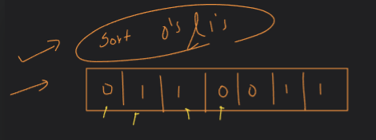

 # Array-02

  ## Starting with leetcode question.

  ### Q-136. Single Number:

### APPROACH:


  

  

### Solution:

  

## VSCode Solution:

``` cpp
    #include <iostream>
    using namespace std;

    int findUniqueNumber(int arr[], int n)
    {
        int ans = 0;
        for (int i = 0; i < n; i++)
        {
            ans = arr[i] ^ ans;
        }
        return ans;
    }

    int main()
    {

        int arr[] = {2, 4, 4, 2, 1, 6, 1};
        int size = 7;

        int ans = findUniqueNumber(arr, size);
        cout << "Unique No. : " << ans << endl;
    }
```
Here it is Linear Traverse, total N operations are there.

Time Complexity : O(N)

Space Complexity : O(1)

## Alternate Solution:

```cpp
int alternateSolnFindUnique(int arr[], int n)
{
    for (int i = 0; i < n; i++)
    {
        int cnt = 0;
        for (int j = 0; j < n; j++)
        {
            if (arr[i] == arr[j])
            {
                cnt++;
            }
        }
        if (cnt == 1)
        {
            return arr[i];
        }
    }
    return 0;
}

int main()
{

    int arr[] = {2, 4, 3, 3, 4};
    // int size = 7;
    int size = 5;

    // int ans = findUniqueNumber(arr, size);
    int ans = alternateSolnFindUnique(arr, size);
    cout << "Unique No. : " << ans << endl;
}

```

Time Complexity : O(N<sup>2</sup>)

Space Complexity : O(1)
 

### Q. Sort 0's and 1's, make 0's first in array and then 1's in rest blocks:


## approach:1 => count no of 0's and 1's and arrange them sequentially.

### Dry Run:


### Code:

```cpp
#include <iostream>
using namespace std;

void arrangeZeroAndOne(int arr[], int size)
{
    int zeroCnt = 0;
    int oneCount = 0;
    for (int i = 0; i < size; i++)
    {
        if (arr[i] == 0)
        {
            zeroCnt++;
        }
        else
        {
            oneCount++;
        }
    }
    for (int i = 0; i < zeroCnt; i++)
    {
        arr[i] = 0;
    }
    for (int i = zeroCnt; i < size; i++)
    {
        arr[i] = 1;
    }
    cout << "Your final array : ";
    for (int i = 0; i < size; i++)
    {
        cout << arr[i] << " ";
    }
}

int main()
{
    int arr[] = {0, 1, 1, 1, 0, 0, 1};
    int size = 7;
    arrangeZeroAndOne(arr, size);
}

```
## approach:2 => using fill method

### Code:

```cpp
#include <iostream>
using namespace std;

void arrangeZeroAndOne(int arr[], int size)
{
    int zeroCnt = 0;
    int oneCount = 0;
    for (int i = 0; i < size; i++)
    {
        if (arr[i] == 0)
        {
            zeroCnt++;
        }
        else
        {
            oneCount++;
        }
    }

    fill(arr, arr + zeroCnt, 0);
    fill(arr + zeroCnt, arr + size, 1);

    cout << "Your final array : ";
    for (int i = 0; i < size; i++)
    {
        cout << arr[i] << " ";
    }
}

int main()
{
    int arr[] = {0, 1, 1, 1, 0, 0, 1};
    int size = 7;
    arrangeZeroAndOne(arr, size);
}
```

## approach:3 => sort(start_address, end_address) T.C: nlogn

### Code:

```cpp
#include <iostream>
#include<algorithm>
using namespace std;

int main()
{
    int arr[] = {0, 1, 1, 1, 0, 0, 1};
    int size = 7;
    sort(arr, arr+size);
    cout << "Your final array : ";
    for (int i = 0; i < size; i++)
    {
        cout << arr[i] << " ";
    }
}
```

## approach:4 => 2 pointer approach

### Code:

```cpp
#include <iostream>
using namespace std;

void sort0And1By2Pointer(int arr[], int size)
{
    int s = 0;
    int e = size - 1;
    while (s < e)
    {

        if (arr[s] == 1 && arr[e] == 0)
        {
            swap(arr[s], arr[e]);
            s++;
            e--;
        }
        else
        {
            if (arr[s] == 0)
            {
                s++;
            }
            if (arr[e] == 1)
            {
                e--;
            }
        }
    }
}

int main()
{
    // Two pointer in sort 0s and 1s:
    int arr[] = {1, 0, 1, 0, 1, 0, 0};
    int size = 7;
    sort0And1By2Pointer(arr, size);
    cout << endl;
    for (int i = 0; i < size; i++)
    {
        cout << arr[i] << " ";
    }
}

```


## Homework:

### 1. Only 0s and 1s in array, flip the 0->1 and 1->0
(Hint: by taking 1's compliment and 2's compliment)
 

### 2. Dutch National Flag : 
 


### Q. Print all pairs:

#### Code:

```cpp
#include <iostream>
using namespace std;

void printAllPairs(int arr[], int size)
{
    for (int i = 0; i < size; i++)
    {
        for (int j = 0; j < size; j++)
        {
            cout << "{" << arr[i] << "," << arr[j] << "} ";
        }
        cout << endl;
    }
}

int main()
{
    int arr[] = {10, 20, 30, 40};
    int size = 4;
    printAllPairs(arr, size);
}

```

#### Practice:


### Q. TwoSum and ThreeSum:

#### Code:

```cpp
#include <iostream>
using namespace std;

pair<int, int> checkTwoSums(int arr[], int size, int target)
{
    pair<int, int> ans = make_pair(-1, -1);
    for (int i = 0; i < size; i++)
    {
        for (int j = 0; j < size; j++)
        {
            if (arr[i] + arr[j] == target)
            {
                ans.first = arr[i];
                ans.second = arr[j];
                return ans;
            }
        }
    }
    return ans;
}

int main()
{
    int arr[] = {10, 5, 20, 15, 30};
    int size = 5;
    int target = 35;
    pair<int, int> res = checkTwoSums(arr, size, target);
    if (res.first == -1 && res.second == -1)
    {
        cout << "Pair not Found!" << endl;
    }
    else
    {
        cout << "Pair Found! " << "{" << res.first << "," << res.second << "}" << "" << endl;
    }
}
```
### LeetCode Que. Two Sum:

#### Code:

```cpp
class Solution {
public:
    vector<int> twoSum(vector<int>& nums, int target) {
        vector<int> ans;
        int size = nums.size();
        for(int i=0;i<size;i++){
            for(int j=i+1;j<size;j++){
                if(nums[i]+nums[j]==target){
                    ans.push_back(i);
                    ans.push_back(j);
                    return ans;
                }
            }
        }
        return ans;
    }
};
```

### Q. 3Sum:

#### Code:

```cpp
#include <iostream>
using namespace std;

void threeSum(int nums[], int size)
{
    for (int i = 0; i < size; i++)
    {
        for (int j = i + 1; j < size; j++)
        {
            for (int k = j + 1; k < size; k++)
            {
                if (nums[i] + nums[j] + nums[k] == 0)
                {
                    cout << nums[i] << " " << nums[j] << " " << nums[k] << endl;
                }
            }
        }
    }
    return;
}

int main()
{
    int arr[] = {-1, 0, 1, 2, -1, -4};
    int size = 6;
    threeSum(arr, size);
}

```
### Q. Shift n element in array (Rotate Array):

#### Approach:


#### Code:

```cpp
#include <iostream>
using namespace std;

void rotateArray(int arr[], int size, int shift)
{
    shift = shift % size;
    // copy last "shift" no. of elements into temp array.
    if (shift == 0)
    {
        return;
    }

    int temp[100];
    int j = 0;
    for (int i = size - shift; i < size; i++)
    {
        temp[j] = arr[i];
        j++;
    }
    for (int j = size - 1; j >= shift; j--)
    {
        arr[j] = arr[j - shift];
    }
    for (int k = 0; k < shift; k++)
    {
        arr[k] = temp[k];
    }
}

int main()
{
    int arr[] = {10, 20, 30, 40, 50, 60};
    int size = 6;
    // we have to made 2 shift
    int shift = 4;

    cout << "Before :" << endl;
    for (int i = 0; i < size; i++)
    {
        cout << arr[i] << " ";
    }

    rotateArray(arr, size, shift);

    cout << endl;
    cout << "After :" << endl;
    for (int i = 0; i < size; i++)
    {
        cout << arr[i] << " ";
    }
}

```

