# Array-03

## Vector:

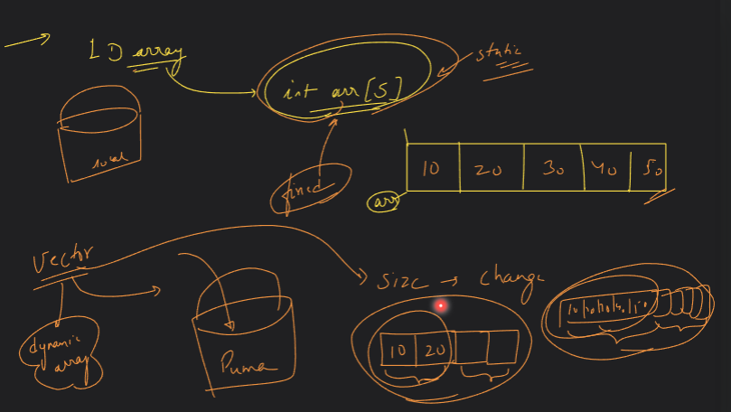

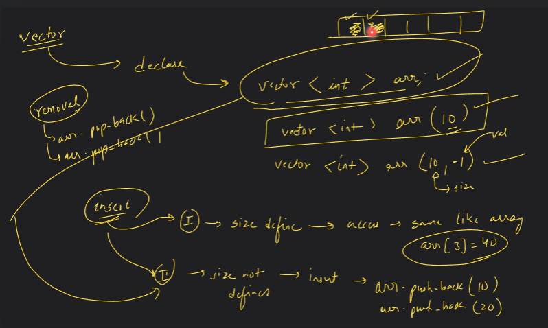

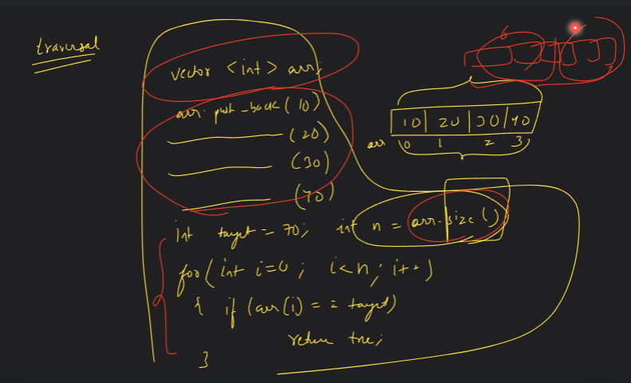

## 2D Arrays:

### IMP Formula (how 2-D space cell stored in a 1-D array index):

#### (C*i)+j;  

c = total no. of columns.
i= row index.
j = column index.

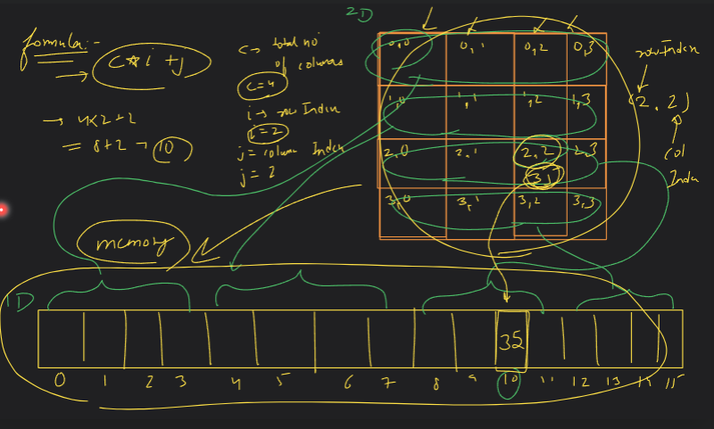

### Declaration
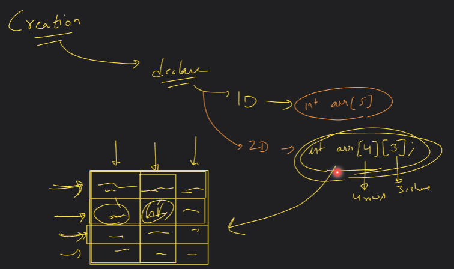

### Initialization:
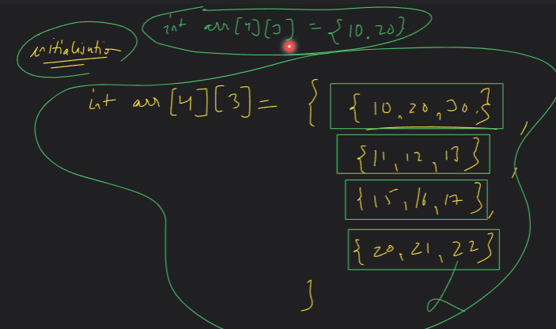

### Access:
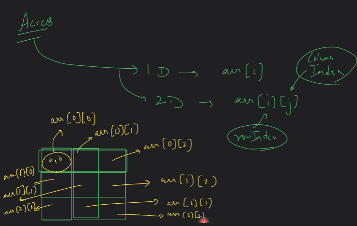

### Printing:
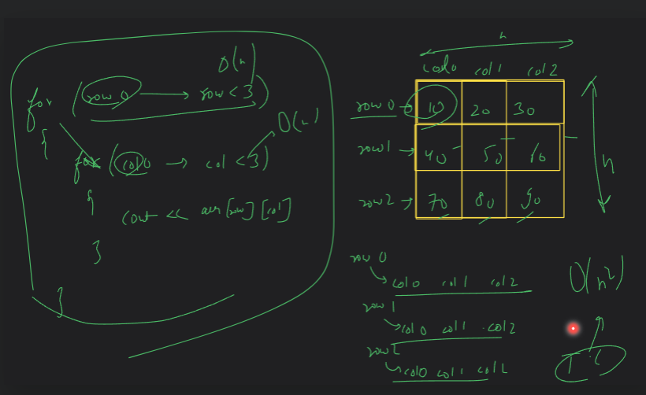

### Code:
```cpp
#include <iostream>
using namespace std;

void print2DArray(int arr[3][3], int row, int column)
{
    for (int i = 0; i < row; i++)
    {
        for (int j = 0; j < column; j++)
        {
            cout << arr[i][j] << " ";
        }
        cout << endl;
    }
}

int main()
{

    // declare
    int arr[4][3];

    // initialize
    int arr1[3][2] = {
        {10, 20},
        {30, 40},
        {50, 60}};

    // access
    // cout << arr1[2][1];

    // printing
    // int row = 3;
    // int column = 2;
    // print2DArray(arr1, row, column);

    // create limited value 2D array
    // int arr2[3][3] = {10, 20, 30};
    int arr2[3][3];
    int row = 3;
    int column = 3;
    print2DArray(arr2, row, column);

    return 0;
}
```

## HOMEWORK:

### Fill in 2D:
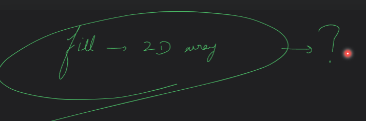

## Ways to print 2D Array :
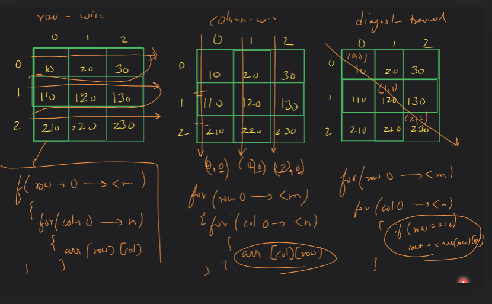

### Code:
```cpp
#include <iostream>
using namespace std;

void print2DArrayRow(int arr[3][3], int row, int column)
{
    for (int i = 0; i < row; i++)
    {
        for (int j = 0; j < column; j++)
        {
            cout << arr[i][j] << " ";
        }
        cout << endl;
    }
}

void print2DArrayColumn(int arr[3][3], int row, int column)
{
    for (int i = 0; i < column; i++)
    {
        for (int j = 0; j < row; j++)
        {
            cout << arr[j][i] << " ";
        }
        cout << endl;
    }
}

void print2DArrayDiagonally(int arr[3][3], int row, int column)
{
    for (int i = 0; i < row; i++)
    {
        for (int j = 0; j < column; j++)
        {
            if (i == j)
            {
                cout << arr[i][j] << " ";
            }
            else
            {
                cout << "   ";
            }
        }
        cout << endl;
    }
}

int main()
{
    int arr2[3][3] = {
        {10, 20, 30},
        {40, 50, 60},
        {70, 80, 90}};
    int row = 3;
    int column = 3;
    cout << "Rowwise : " << endl;
    print2DArrayRow(arr2, row, column);
    cout << endl
         << "Columnwise : " << endl;
    print2DArrayColumn(arr2, row, column);
    cout << endl
         << "Diagonally : " << endl;
    print2DArrayDiagonally(arr2, row, column);

    return 0;
}
```

## Both Diagonal Printing:

### Code:

```cpp
#include <iostream>
using namespace std;

void print2DArrayDiagonally1(int arr[3][3], int row, int column)
{
    for (int i = 0; i < row; i++)
    {
        for (int j = 0; j < column; j++)
        {
            if (i == j)
            {
                cout << arr[i][j] << " ";
            }
            else
            {
                cout << "   ";
            }
        }
        cout << endl;
    }
}

void print2DArrayDiagonally2(int arr[3][3], int row, int column)
{
    for (int i = 0; i < row; i++)
    {
        for (int j = 0; j < column; j++)
        {
            if (i == row - j - 1)
            {
                cout << arr[i][j] << " ";
            }
            else
            {
                cout << "   ";
            }
        }
        cout << endl;
    }
}

int main()
{
    int arr2[3][3] = {
        {10, 20, 30},
        {40, 50, 60},
        {70, 80, 90}};
    int row = 3;
    int column = 3;
         << "Diagonally 1: " << endl;
    print2DArrayDiagonally1(arr2, row, column);
    cout << endl
         << "Diagonally 2: " << endl;
    print2DArrayDiagonally2(arr2, row, column);

    return 0;
}
```

## Taking Input in 2D Array:

### Code:

```cpp
#include <iostream>
using namespace std;

void print2DArrayRow(int arr[][2], int row, int column)
{
    for (int i = 0; i < row; i++)
    {
        for (int j = 0; j < column; j++)
        {
            cout << arr[i][j] << " ";
        }
        cout << endl;
    }
}

void print2DArrayColumn(int arr[][2], int row, int column)
{
    for (int i = 0; i < column; i++)
    {
        for (int j = 0; j < row; j++)
        {
            cout << arr[j][i] << " ";
        }
        cout << endl;
    }
}


void rowwiseInputIn2DArray(int arr[][2], int r, int c)
{
    for (int i = 0; i < r; i++)
    {
        for (int j = 0; j < c; j++)
        {
            cin >> arr[i][j];
        }
    }
}

void columnwiseInputIn2DArray(int arr[][2], int r, int c)
{
    for (int i = 0; i < c; i++)
    {
        for (int j = 0; j < r; j++)
        {
            cin >> arr[j][i];
        }
    }
}

int main()
{
    int arr[3][2];
    int r = 3;
    int c = 2;

    rowwiseInputIn2DArray(arr, r, c);
    // columnwiseInputIn2DArray(arr, r, c);

    cout << "Final Array(rowwise) : " << endl;
    print2DArrayRow(arr, r, c);
    cout << endl;

    cout << "Final Array(columnwise) : " << endl;
    print2DArrayColumn(arr, r, c);
    cout << endl;
    return 0;
}
```

## Searching for target element in 2D array:

### Code:

```cpp
#include <iostream>
using namespace std;

bool linearSearchOn2DArray(int arr[][3], int r, int c, int target)
{
    for (int i = 0; i < r; i++)
    {
        for (int j = 0; j < c; j++)
        {
            if (arr[i][j] == target)
            {
                return true;
            }
        }
    }
    return false;
}

pair<int, int> linearSearchOn2DArrayReturn(int arr[][3], int r, int c, int target)
{
    pair<int, int> ans = make_pair(-1, -1);
    for (int i = 0; i < r; i++)
    {
        for (int j = 0; j < c; j++)
        {
            if (arr[i][j] == target)
            {
                ans.first = i;
                ans.second = j;
                return ans;
            }
        }
    }
    return ans;
}

int main()
{
    // Searching for target in 2D array:
    int arr[3][3] = {
        {10, 20, 30},
        {40, 50, 60},
        {70, 80, 90}};

    int r = 3;
    int c = 3;
    int target = 90;

    // Return Exist or not
    // bool found = linearSearchOn2DArray(arr, r, c, target);
    // if (found)
    // {
    //     cout << "Element Present!";
    // }
    // else
    // {
    //     cout << "Element not Present!";
    // }

    // Returning Index
    pair<int, int> ans = linearSearchOn2DArrayReturn(arr, r, c, target);
    if (ans.first == -1 || ans.second == -1)
    {
        cout << "Element not found!" << endl;
    }
    else
    {
        cout << "Element found at index {" << ans.first << "," << ans.second << "}" << endl;
    }
    return 0;
}
```

## Now using Vector instead of 2D array to solve problems:

### Using vector instead of 2D array like:
```cpp
vector<vector<int>> arr(4, vector<int>(3,0))
```
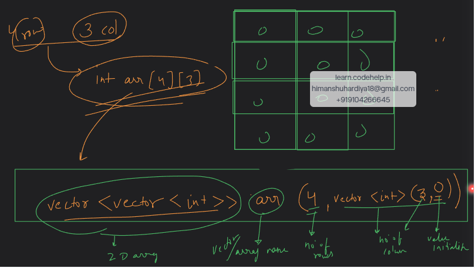

## Q. Minimum and Maximum in 2D Array:

```cpp
#include <iostream>
using namespace std;

int minimumIn2DArray(int arr[][3], int r, int c)
{
    int min = INT_MAX;
    for (int i = 0; i < r; i++)
    {
        for (int j = 0; j < c; j++)
        {
            if (arr[i][j] < min)
            {
                min = arr[i][j];
            }
        }
    }
    return min;
}

int maximumIn2DArray(int arr[][3], int r, int c)
{
    int max = INT_MIN;
    for (int i = 0; i < r; i++)
    {
        for (int j = 0; j < c; j++)
        {
            if (arr[i][j] > max)
            {
                max = arr[i][j];
            }
        }
    }
    return max;
}

int main()
{
    // Finding Minimum value in 2D Array:
    int arr[3][3] = {
        {70, 23, 41},
        {27, 69, 06},
        {56, 12, 18}};
    int r = 3;
    int c = 3;
    int res = minimumIn2DArray(arr, r, c);
    cout << "Min: " << res << endl;

    // Finding Maximum value in 2D Array:
    int arr2[3][3] = {
        {70, 23, 41},
        {27, 69, 06},
        {56, 12, 18}};
    int rs = 3;
    int cs = 3;
    int res2 = maximumIn2DArray(arr2, rs, cs);
    cout << "Max: " << res2;
    return 0;
}
```
 
## Q. Find Sum of each row/column in 2D Array:

```cpp
#include <iostream>
using namespace std;

void rowSumIn2DArray(int arr[][3], int r, int c)
{
    for (int i = 0; i < r; i++)
    {
        int sum = 0;
        for (int j = 0; j < c; j++)
        {
            sum = sum + arr[i][j];
        }
        cout << "Sum of" << " row " << i + 1 << " is " << sum << endl;
    }
}

void columnSumIn2DArray(int arr[][3], int r, int c)
{
    for (int i = 0; i < c; i++)
    {
        int sum = 0;
        for (int j = 0; j < r; j++)
        {
            sum = sum + arr[j][i];
        }
        cout << "Sum of" << " column " << i + 1 << " is " << sum << endl;
    }
}

void diagonalSumIn2DArray1(int arr[][3], int r, int c)
{
    int sum = 0;
    for (int i = 0; i < r; i++)
    {
        for (int j = 0; j < c; j++)
        {
            if (i == j)
            {
                sum = sum + arr[i][j];
            }
        }
    }
    cout << "Sum of Diagonal 1" << " is " << sum << endl;
}

void diagonalSumIn2DArray2(int arr[][3], int r, int c)
{
    int sum = 0;
    for (int i = 0; i < r; i++)
    {
        for (int j = 0; j < c; j++)
        {
            if (i == r - j - 1)
            {
                sum = sum + arr[i][j];
            }
        }
    }
    cout << "Sum of Diagonal 2" << " is " << sum << endl;
}


int main()
{
    // Row & Column & Diagonal wise Sum in 2D Array:
    int arr2[3][3] = {
        {10, 20, 30},
        {40, 50, 60},
        {70, 80, 90}};
    int rs = 3;
    int cs = 3;
    rowSumIn2DArray(arr2, rs, cs);
    cout << endl;
    columnSumIn2DArray(arr2, rs, cs);
    cout << endl;
    diagonalSumIn2DArray1(arr2, rs, cs);
    cout << endl;
    diagonalSumIn2DArray2(arr2, rs, cs);
    cout << endl;
    return 0;
}
```
## Q. Transpose the 2D Array:

### Approach:
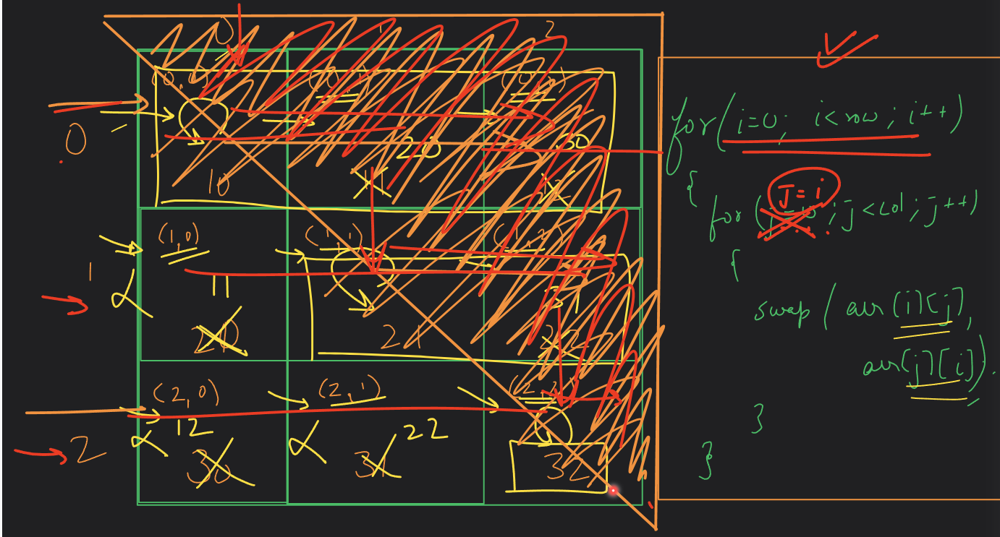

### Code:
```cpp
#include <iostream>
using namespace std;

void transposeIn2DArray(int arr[][3], int r, int c)
{
    for (int i = 0; i < r; i++)
    {
        for (int j = i; j < c; j++)
        {
            swap(arr[i][j], arr[j][i]);
        }
    }
    for (int i = 0; i < r; i++)
    {
        for (int j = 0; j < c; j++)
        {
            cout << arr[i][j] << " ";
        }
        cout << endl;
    }
}

int main()
{
    int arr2[3][3] = {
        {10, 20, 50},
        {40, 50, 60},
        {90, 80, 90}};
    int rs = 3;
    int cs = 3;
    transposeIn2DArray(arr2, rs, cs);

    return 0;
}
```


