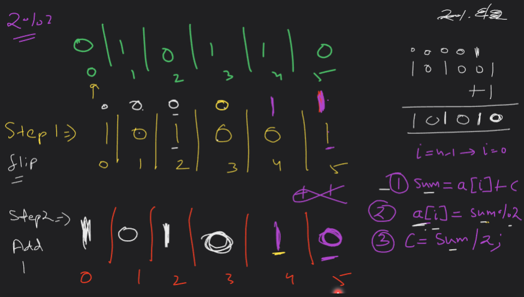

## Hash Map

### It is a table, which has non duplicating entries in key column and some corresponding entry in value column.


## Declaration of Unordered Map:


### Code:
```cpp
#include <iostream>
#include <unordered_map>
using namespace std;

int main()
{

    unordered_map<int, int> desk_map;

    // insertion
    desk_map[1] = 53;
    desk_map[2] = 54;
    desk_map[3] = 55;

    // resassign
    desk_map[2] = 56;

    // iterate
    unordered_map<int, int>::iterator it; // syntax to access each entry in map
    for (it = desk_map.begin(); it != desk_map.end(); it++)
    {
        int key = it->first;
        int value = it->second;
        cout << "Key : " << key << " Value : " << value << endl;
    }
    // OR
    // for (auto it : desk_map)
    // {
    //     int key = it.first;
    //     int value = it.second;
    //     cout << "Key : " << key << " Value : " << value << endl;
    // }

    // access/find
    if (desk_map.find(2) != desk_map.end())
    {
        int value = desk_map[2];
        cout << "Found : " << value << endl;
    }

    // deletion
    desk_map.erase(2);

    cout << "After deletion :" << endl;
    for (it = desk_map.begin(); it != desk_map.end(); it++)
    {
        int key = it->first;
        int value = it->second;
        cout << "Key : " << key << " Value : " << value << endl;
    }

    return 0;
}
```

## Q. 2's Compliment (1s Compliment + 1):

### Binary Addition Approach:


### Solution Approach:



### Code:

```cpp
#include <iostream>
#include <vector>
using namespace std;

vector<int> findComplement(vector<int> binary)
{
    int n = binary.size();
    int n1 = n + 1;
    vector<int> ans(n1, 0);

    // 1. Flip the bits:
    for (int i = 0; i < n; i++)
    {
        ans[i + 1] = !binary[i];
        // ex: binary-[0,0,0,0]
        //     ans- [0,1,1,1,1]
    }

    // 2. Adding +1 in array:
    int c = 1;
    for (int j = n1 - 1; j > 0; j--)
    {
        int sum;
        sum = ans[j] + c;
        ans[j] = sum % 2;
        c = sum / 2;
    }
    if (c)
    {
        ans[0] = c;
    }
    return ans;
}

int main()
{
    // 2's Compliment
    vector<int> binary = {0, 1, 0, 1, 1, 1, 0, 1};
    vector<int> ans = findComplement(binary);
    cout << "Before: " << endl;
    for (int i = 0; i < binary.size(); i++)
    {
        cout << binary[i] << " ";
    }
    cout << endl;
    cout << "After: " << endl;
    int ansSizeStart = 0;
    if (!ans[0])
    {
        ansSizeStart++;
    }
    for (int i = ansSizeStart; i < ans.size(); i++)
    {
        cout << ans[i] << " ";
    }

    return 0;
}
```

## Q. Single Number( using hashmap):

### LeetCode Solution:

```cpp
class Solution {
public:
    int singleNumber(vector<int>& nums) {
        unordered_map<int, int> freqMap;

        for(int i=0; i<nums.size(); i++){
            int num = nums[i];
            freqMap[num]++;
        }

        unordered_map<int, int>::iterator it;
        int ans;
        for(it=freqMap.begin(); it!=freqMap.end(); it++){
            int key = it->first;
            int value = it->second;
            if(value==1){
                ans = key;
                break;
            }
        }
        return ans;
    }
};
```

## Q. Rotate assets/image

### LeetCode Solution:

```cpp
class Solution {
public:
    void rotate(vector<vector<int>>& matrix) {
        // 1. Transpose
        for(int i=0; i<matrix.size(); i++){
            for(int j=i; j<matrix[0].size(); j++){
                swap(matrix[i][j], matrix[j][i]);
            }
        }

        // 2. Reverse rowwise
        for(int i=0; i<matrix.size(); i++){
            reverse(matrix[i].begin(), matrix[i].end());
        }
    }
};
```

## Q. Maximum Subarray:
### It is failed/TLE when we use Brute Force Approach, so we need to use Kadane's Algo(T.C. : O(N)).

### Approach:


### LeetCode Solution:
```cpp
class Solution {
public:
    // int naive(vector<int> &nums){
    //     int ans = INT_MIN;
    //     for(int i=0; i<nums.size(); i++){
    //         int sum=0;
    //         for(int j=i; j<nums.size(); j++){
    //             sum=sum+nums[j];
    //             ans = max(ans, sum);
    //         }
    //     }
    //     return ans;
    // }

    int kadaneAlgo(vector<int> &nums){
        int ans=INT_MIN;
        int sum=0;
        for(int i=0; i<nums.size(); i++){
            sum=sum+nums[i];
            ans=max(ans,sum);
            if(sum<0){
                sum=0;
            }
        }
        return ans;
    }

    int maxSubArray(vector<int>& nums) {
        return kadaneAlgo(nums);
    }
};
```

## Q. (Already in Assignment) Missing No. from an array with Duplicates.

### Approach:


### Code:
```cpp
#include <iostream>
#include <vector>
using namespace std;

int main()
{
    // Missing No. from an array with Duplicates
    vector<int> v = {1, 2, 5, 3, 7, 6};
    v.insert(v.begin(), 19);

    // Now => 19 is at 0 index.
    //        1 is at 1 index.
    //        3 is at 2 index.

    for (int i = 1; i < v.size(); i++)
    {
        int index = abs(v[i]);
        if (v[index] > 0)
        {
            v[index] *= -1;
        }
    }

    int ans = -1;
    for (int j = 1; j < v.size(); j++)
    {
        if (v[j] > 0)
        {
            ans = j;
            break;
        }
    }

    cout << "Missing element is " << ans << endl;

    return 0;
}
```


