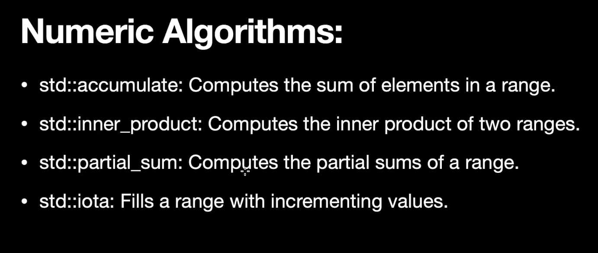
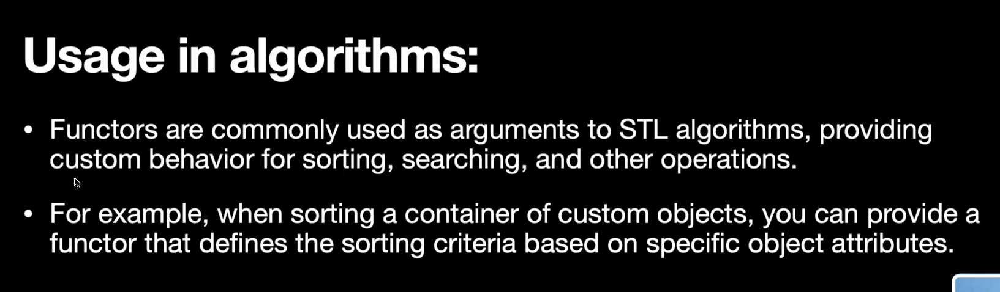

# C++ STL(Standard Template Library) - 02

## 2. Algorithms:


- ### Iterators and Iterating Algorithm:


#### Code:
```cpp
#include <iostream>
#include <algorithm>
#include <vector>
using namespace std;

void printDouble(int a)
{
    cout << 2 * a << " ";
}

bool checkEven(int a)
{
    return a % 2 == 0;
}

int main()
{
    vector<int> arr(5);
    arr[0] = 10;
    arr[1] = 20;
    arr[2] = 30;
    arr[3] = 40;
    arr[4] = 50;

    // for_each
    cout << "Elements are : ";
    for_each(arr.begin(), arr.end(), printDouble);
    cout << endl
         << endl;

    // find
    int target = 30;
    auto it = find(arr.begin(), arr.end(), target);
    cout << "Element " << *it << " found!" << endl
         << endl;

    // find_if
    auto it1 = find_if(arr.begin(), arr.end(), checkEven);
    cout << "First element in container which follow the given function is " << *it1 << endl
         << endl;

    // count
    int target1 = 40;
    int cnt = count(arr.begin(), arr.end(), target1);
    cout
        << "Number of times " << target1 << " occur in container is " << cnt << endl
        << endl;

    // count_if
    int cnt1 = count_if(arr.begin(), arr.end(), checkEven);
    cout << "Number of element in container which follow the given function is/are " << cnt1 << endl
         << endl;

    // sort
    vector<int> arr1(3);
    arr1[0] = 50;
    arr1[1] = 20;
    arr1[2] = 35;
    sort(arr1.begin(), arr1.end());
    cout << "After applying sort on arr1 : ";
    for (auto it : arr1)
    {
        cout << it << " ";
    }
    cout << endl
         << endl;

    // reverse
    reverse(arr1.begin(), arr1.end());
    cout << "After applying reverse on arr1 : ";
    for (auto it : arr1)
    {
        cout << it << " ";
    }
    cout << endl
         << endl;

    // rotate
    cout << "Before Rotate: ";
    for (auto it : arr)
    {
        cout << it << " ";
    }
    cout << endl;
    rotate(arr.begin(), arr.begin() + 3, arr.end());
    cout
        << "After Rotate (rotate vector left by given position): ";
    for (auto it : arr)
    {
        cout << it << " ";
    }
    cout << endl
         << endl;

    // unique => remove duplicate from sorted array/vector
    vector<int> arr2(5);
    arr2[0] = 1;
    arr2[1] = 1;
    arr2[2] = 2;
    arr2[3] = 3;
    arr2[4] = 3;

    auto it2 = unique(arr2.begin(), arr2.end());
    // before "it" iterator all elements are unique after it all are duplicate
    arr2.erase(it2, arr2.end());
    cout
        << "All unique elements are : ";
    for (auto it : arr2)
    {
        cout << it << " ";
    }
    cout << endl
         << endl;

    // partition
    auto it3 = partition(arr2.begin(), arr2.end(), checkEven);
    cout << "Partition of array based on given function : ";
    for (auto it : arr2)
    {
        cout << it << " ";
    }
    cout << endl << endl;

    return 0;
}
```

- ### Numeric Algorithms:
  

#### Code:
```cpp
#include <iostream>
#include <algorithm>
#include <numeric>
#include <vector>
using namespace std;

int main()
{
    vector<int> arr(5);
    arr[0] = 10;
    arr[1] = 20;
    arr[2] = 30;
    arr[3] = 40;
    arr[4] = 50;

    // accumulate
    int sum = accumulate(arr.begin(), arr.end(), 0);
    cout << "Total sum of a container is " << sum << endl
         << endl;

    // inner_product
    vector<int> first(3);
    first[0] = 10;
    first[1] = 20;
    first[2] = 30;

    vector<int> second(3);
    second[0] = 40;
    second[1] = 50;
    second[2] = 60;

    int ans = inner_product(first.begin(), first.end(), second.begin(), 0);
    cout << "Inner Product b/w 'first' and 'second' container is " << ans << endl
         << endl;

    // partial_sum
    vector<int> res(first.size());
    partial_sum(first.begin(), first.end(), res.begin());
    cout << "Partial Sum of 'first' is : ";
    for (auto it : res)
    {
        cout << it << " ";
    }
    cout << endl
         << endl;

    // iota
    vector<int> iotaVector(5);
    iota(iotaVector.begin(), iotaVector.end(), 1);
    cout << "'iotaVector' after using iota method : ";
    for (auto it : iotaVector)
    {
        cout << it << " ";
    }
    cout << endl
         << endl;

    return 0;
}
```

- ### Searching and Finding Algorithm:


#### Code:

```cpp

#include <iostream>
#include <algorithm>
#include <vector>
using namespace std;

int main()
{

    vector<int> arr(5);
    arr[0] = 10;
    arr[1] = 20;
    arr[2] = 30;
    arr[3] = 40;
    arr[4] = 50;

    // binary_search
    int target = 30;
    bool ans = binary_search(arr.begin(), arr.end(), target);
    cout << "Target is " << ((ans) ? "present!" : "not present!") << endl
         << endl;

    // lower_bound
    int target2 = 35;
    auto it = lower_bound(arr.begin(), arr.end(), target2);
    cout << "Answer of lower_bound is " << *it << endl
         << endl;

    // upper_bound
    int target3 = 40;
    auto it1 = upper_bound(arr.begin(), arr.end(), target3);
    cout << "Answer of upper_bound is " << *it1 << endl
         << endl;

    // equal_range
    pair<vector<int>::iterator, vector<int>::iterator> range;
    int target4 = 50;
    range = equal_range(arr.begin(), arr.end(), target4);
    cout << target4 << " is present in the container from index " << (range.first - arr.begin()) << " to " << (range.second - arr.begin()) << endl
         << endl;

    return 0;
}
```

- ### Min and Max Algorithm:


#### Code:

```cpp
#include <iostream>
#include <algorithm>
#include <vector>
using namespace std;

int main()
{

    // max
    int a = 10;
    int b = 20;

    cout << "Max b/w a and b is " << max(a, b) << endl
         << endl;

    // max_element
    vector<int> arr(5);
    arr[0] = 10;
    arr[1] = 20;
    arr[2] = 30;
    arr[3] = 40;
    arr[4] = 50;

    auto it = max_element(arr.begin(), arr.end());
    cout << "Max element in container is " << *it << endl
         << endl;

    // min
    cout << "Min b/w a and b is " << min(a, b) << endl
         << endl;

    // min_element
    auto it2 = min_element(arr.begin(), arr.end());
    cout << "Min element in container is " << *it2 << endl
         << endl;

    return 0;
}
```

- ### Heap Algorithm:


#### Code:

```cpp
#include <iostream>
#include <algorithm>
#include <vector>
using namespace std;

int main()
{
    vector<int> arr;
    arr.push_back(22);
    arr.push_back(11);
    arr.push_back(55);
    arr.push_back(66);
    arr.push_back(77);

    // make_heap
    cout << "The heap of arr is : ";
    make_heap(arr.begin(), arr.end());
    for (auto it : arr)
    {
        cout << it << " ";
    }
    cout << endl
         << endl;

    // push_heap
    arr.push_back(99);
    push_heap(arr.begin(), arr.end());
    cout << "After push_heap : ";
    for (auto it : arr)
    {
        cout << it << " ";
    }
    cout << endl
         << endl;

    // pop_heap
    pop_heap(arr.begin(), arr.end());
    arr.pop_back();
    cout << "After pop_heap : ";
    for (auto it : arr)
    {
        cout << it << " ";
    }
    cout << endl
         << endl;

    // sort_heap
    sort_heap(arr.begin(), arr.end());
    cout << "After sort_heap : ";
    for (auto it : arr)
    {
        cout << it << " ";
    }
    cout << endl
         << endl;

    return 0;
}
```


- ### Set Algorithm:


#### Code:

```cpp
#include <iostream>
#include <algorithm>
#include <vector>
using namespace std;

int main()
{

    vector<int> first(3);
    first[0] = 10;
    first[1] = 20;
    first[2] = 30;

    vector<int> second(3);
    second[0] = 30;
    second[1] = 40;
    second[2] = 50;

    // set_union
    vector<int> res;
    set_union(first.begin(), first.end(), second.begin(), second.end(), inserter(res, res.begin()));
    cout << "After set_union : ";
    for (auto it : res)
    {
        cout << it << " ";
    }
    cout << endl
         << endl;

    // set_intersection
    vector<int> res1;
    set_intersection(first.begin(), first.end(), second.begin(), second.end(), inserter(res1, res1.begin()));
    cout << "After set_intersection : ";
    for (auto it : res1)
    {
        cout << it << " ";
    }
    cout << endl
         << endl;

    // set_difference
    vector<int> res2;
    set_difference(first.begin(), first.end(), second.begin(), second.end(), inserter(res2, res2.begin()));
    cout << "After set_difference : ";
    for (auto it : res2)
    {
        cout << it << " ";
    }
    cout << endl
         << endl;

    // set_symmetric_difference
    vector<int> res3;
    set_symmetric_difference(first.begin(), first.end(), second.begin(), second.end(), inserter(res3, res3.begin()));
    cout << "After set_symmetric_difference : ";
    for (auto it : res3)
    {
        cout << it << " ";
    }
    cout << endl
         << endl;

    return 0;
}
```

## 3. Iterators:


### Creating & Traversing - Iterators


#### Code:
```cpp
#include <iostream>
#include <vector>
using namespace std;

int main()
{

    vector<int> arr;
    arr.push_back(10);
    arr.push_back(20);
    arr.push_back(30);

    // create Iterator
    vector<int>::iterator it = arr.begin();

    // traversing
    cout << "The elements in vector arr : ";
    while (it != arr.end())
    {
        cout << *it << " ";
        it++;
    }
    cout << endl
         << endl;

    return 0;
}
```

### Iterator Operation:


### Iterator Types:


#### Input Iterators:


#### Output Iterators:


#### Forward Iterators:


#### Code:
```cpp
#include <iostream>
#include <forward_list>
using namespace std;

int main()
{
    // creation
    forward_list<int> flist;

    // insertion
    flist.push_front(10);
    flist.push_front(20);
    flist.push_front(30);

    // traverse
    forward_list<int>::iterator it = flist.begin();
    cout << "Forward list is : ";
    while (it != flist.end())
    {
        cout << *it << " ";
        it++;
    }

    // writing in forward list
    it = flist.begin();
    while (it != flist.end())
    {
        (*it) = (*it) + 10;
        it++;
    }
    cout << endl
         << endl;
    it = flist.begin();
    cout << "After writing in forward list : ";
    while (it != flist.end())
    {
        cout << *it << " ";
        it++;
    }
    cout << endl
         << endl;

    // moving backward => not possible to move backward in forward list.
    // it = flist.end();
    // while (it != flist.begin())
    // {
    //     cout << *it << " ";
    //     it--;
    // }
    // cout << endl
    //      << endl;

    return 0;
}
```

#### Bi-directional Iterators:


#### Code:
```cpp
#include <iostream>
#include <list>
using namespace std;

int main()
{
    // creation
    list<int> biDirlist;

    // insertion
    biDirlist.push_front(10);
    biDirlist.push_front(20);
    biDirlist.push_front(30);

    // traverse and printing
    list<int>::iterator it = biDirlist.begin();
    cout << "Bidirectional List is : ";
    while (it != biDirlist.end())
    {
        cout << *it << " ";
        it++;
    }
    cout << endl
         << endl;

    // Updation in bidirectional list
    it = biDirlist.begin();
    while (it != biDirlist.end())
    {
        (*it) = (*it) + 5;
        it++;
    }
    it = biDirlist.begin();
    cout << "After updation in bidirectional list : ";
    while (it != biDirlist.end())
    {
        cout << *it << " ";
        it++;
    }
    cout << endl
         << endl;

    // moving backward in bidirectional
    it = biDirlist.end();
    cout << "Moving backward in bidirectional list : ";
    while (it != biDirlist.begin())
    {
        it--;
        cout << *it << " ";
    }
    cout << endl
         << endl;

    return 0;
}
```

#### Bi-directional Iterators:


#### Code:

```cpp
#include <iostream>
#include <vector>
using namespace std;

int main()
{
    // creation
    vector<int> arr = {1, 2, 3, 4, 5};

    // traverse and printing
    vector<int>::iterator it = arr.begin();
    cout << "Vector is : ";
    while (it != arr.end())
    {
        cout << *it << " ";
        it++;
    }
    cout << endl
         << endl;

    // Updation and Printing
    it = arr.begin();
    while (it != arr.end())
    {
        (*it) = (*it) + 10;
        it++;
    }
    it = arr.begin();
    cout << "After updation vector : ";
    while (it != arr.end())
    {
        cout << *it << " ";
        it++;
    }
    cout << endl
         << endl;

    // Moving backward
    it = arr.end() - 1;
    cout << "Moving backward : ";
    while (it != arr.begin() - 1)
    {
        cout << *it << " ";
        it--;
    }
    cout << endl
         << endl;

    // random access Iterator
    vector<int>::iterator it1 = arr.begin() + 3;
    cout << "Vector value at arr.begin()+3 location : ";
    cout << *it1 << endl
         << endl;

    return 0;
}
```

### Operations supported by Iterators:


### Why use Iterators?


## 4. Functors:
### **Prerequisite : MUST KNOW AND UNDERSTANDING OF "OOPS" CONCEPT** 
#### Ref : https://www.geeksforgeeks.org/object-oriented-programming-in-cpp/

### About:


### Usage:


### Function Call Operator:


### Code:
#### functorOne:
```cpp
#include <iostream>
using namespace std;

class functorOne
{
public:
    bool operator()(int a, int b)
    {
        return a > b;
    }
};

int main()
{

    functorOne cmp;

    if (cmp(20, 10))
    {
        cout << "Here, 20 is greater than 10" << endl
             << endl;
    }
    else
    {
        cout << "20 is less than 10" << endl
             << endl;
        ;
    }

    return 0;
}
```
#### StudentComparator:
```cpp

#include <iostream>
using namespace std;

// class
class Student
{
public:
    int marks;
    string name;
    Student()
    {
    }
    Student(int m, string n)
    {
        this->marks = m;
        this->name = n;
    }
};

// functor
class StudentComparator
{
public:
    bool operator()(Student a, Student b)
    {
        return a.marks < b.marks;
    }
};

int main()
{

    Student s1;
    Student s2;

    s1.marks = 90;
    s1.name = "Ravi";

    s2.marks = 95;
    s2.name = "Kishan";

    StudentComparator cmp;

    if (cmp(s1, s2))
    {
        cout << "Marks of Ravi is less than Kishan" << endl
             << endl;
    }
    else
    {
        cout << "Marks of Kishan is less than Ravi" << endl
             << endl;
    }

    return 0;
}
```
#### CustomComparator:

```cpp

#include <iostream>
#include <vector>
#include <algorithm>
using namespace std;

class comparator
{
public:
    bool operator()(int a, int b)
    {
        return a > b;
    }
};

int main()
{

    vector<int> arr;

    arr.push_back(30);
    arr.push_back(10);
    arr.push_back(20);

    sort(arr.begin(), arr.end(), comparator());
    cout << "Sorting in descending order: ";
    for (int a : arr)
    {
        cout << a << " ";
    }
    cout << endl
         << endl;

    return 0;
}
```

#### CustomStudentComparator:
```cpp

#include <vector>
#include <iostream>
#include <algorithm>
using namespace std;

class Student
{
public:
    int marks;
    string name;
    Student()
    {
    }
    Student(int m, string n)
    {
        this->marks = m;
        this->name = n;
    }
};

class comparator
{
public:
    bool operator()(Student a, Student b)
    {
        if (a.marks == b.marks)
        {
            return a.name < b.name;
        }
        return a.marks > b.marks;
    }
};

int main()
{
    vector<Student> arr;
    arr.push_back(Student(80, "Ravi"));
    arr.push_back(Student(85, "Kishan"));
    arr.push_back(Student(90, "Pankaj"));

    sort(arr.begin(), arr.end(), comparator());

    for (Student it : arr)
    {
        cout << "Marks : " << it.marks << " and Name : " << it.name << endl;
    }
    cout << endl;

    return 0;
}
```

#### CustomPriorityComparator:
```cpp

#include <iostream>
#include <vector>
#include <algorithm>
#include <queue>
using namespace std;

class Student
{
public:
    int marks;
    string name;
    Student()
    {
    }
    Student(int m, string n)
    {
        this->marks = m;
        this->name = n;
    }
};

class comparator
{
public:
    bool operator()(Student a, Student b)
    {
        return a.marks < b.marks;
    }
};

int main()
{

    // priority_queue<int, vector<int>, less<int>> pq; => A priority queue named pq which perform operations on int dtype , use container as vector<int> and comparator as less<int>(create max-heap).

    priority_queue<Student, vector<Student>, comparator> pq;

    pq.push(Student(80, "Ravi"));
    pq.push(Student(60, "Kishan"));
    pq.push(Student(95, "Gopal"));
    pq.push(Student(70, "Shekhar"));

    cout << "Top Student Marks is " << pq.top().marks << " and their Name is " << pq.top().name << endl;
    pq.pop();
    cout << "Top Student Marks is " << pq.top().marks << " and their Name is " << pq.top().name << endl;
    pq.pop();
    cout << "Top Student Marks is " << pq.top().marks << " and their Name is " << pq.top().name << endl;
    pq.pop();
    cout << "Top Student Marks is " << pq.top().marks << " and their Name is " << pq.top().name << endl
         << endl
         << endl;

    return 0;
}
```