# C++ STL(Standard Template Library) - 01

## What is STL?
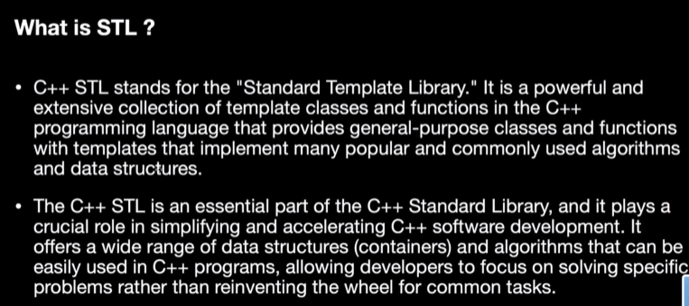

## Why we need STL?


## Components in STL:
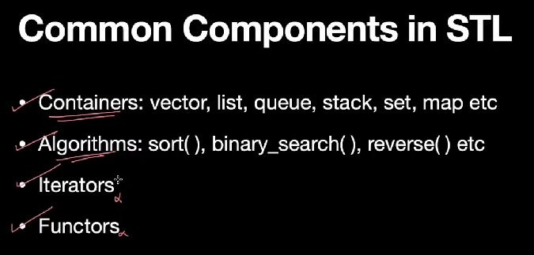

## 1. Containers:
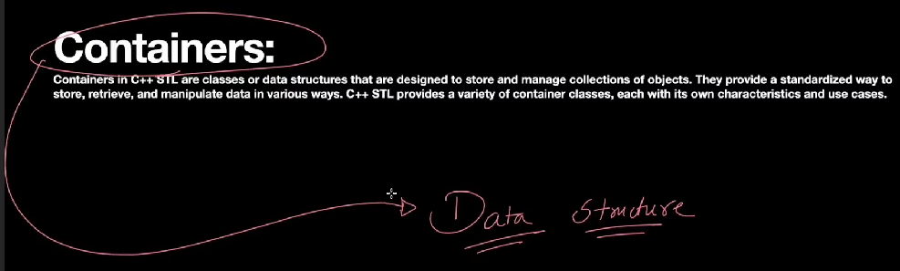

### Vector:
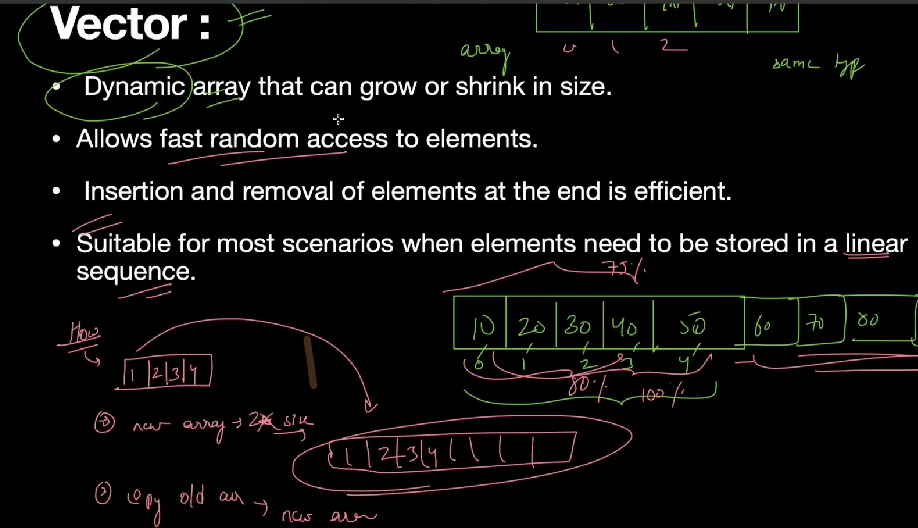

#### Member Functions:
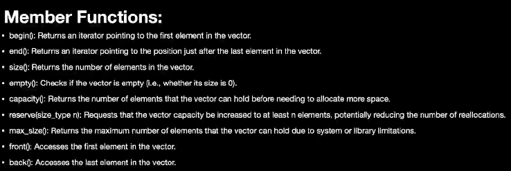
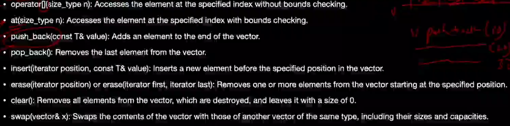

#### Code:
```cpp
#include <iostream>
#include <vector>
using namespace std;

int main()
{

    // VECTOR:

    // creation:
    vector<int> marks;

    // creation with size 10
    vector<int> miles(10);

    // creation with size 15 and initials 0
    vector<int> distances(15, 5);

    // v.begin()
    cout << "v.start() : " << *(distances.begin()) << endl
         << endl;

    // v.end()
    cout << "v.end : " << *(distances.end()) << endl
         << endl;

    // v.push_back()
    distances.push_back(10);
    distances.push_back(20);
    distances.push_back(30);
    distances.push_back(40);

    // v.size()
    cout << "Size of vector is " << distances.size() << endl
         << endl;
    ;

    // v.pop_back()
    distances.pop_back();
    cout << "Size of vector is " << distances.size() << endl
         << endl;
    ;

    // v.front()
    cout << "Front : " << distances.front() << endl
         << endl;

    // v.back()
    cout << "Back : " << distances.back() << endl
         << endl;

    // v.empty()
    cout
        << "v.empty() : ";
    if (distances.empty())
        cout
            << "Vector is Empty" << endl
            << endl;
    else
        cout << "Vector is not Empty" << endl
             << endl;

    // Access using v[i]
    cout << "v[i] : " << distances[15] << endl
         << endl;

    // v.at(i)
    cout << "v.at() : " << distances.at(15) << endl
         << endl;

    // v.capacity()
    vector<int> v;
    cout << "Capacity : " << v.capacity() << endl;
    v.push_back(10);
    v.push_back(20);
    v.push_back(30);
    cout << "Here Size is " << v.size() << " but Capacity is " << v.capacity() << endl
         << endl;

    // v.reserve(value) => It reserves the capacity of vector.

    vector<int> v1;
    cout << "Capacity: " << v1.capacity() << endl;
    v1.reserve(5);
    cout << "After Reserve, Now Capacity: " << v1.capacity() << endl
         << endl;

    // v.max_size()
    cout << "v.max_size() : " << v1.max_size() << endl
         << endl;

    // v.clear()
    cout << "Size : " << v.size() << endl;
    cout << "v.clear() : ";
    v.clear();
    cout << "Now size : " << v.size() << endl
         << endl;

    // v.insert(pos, value)
    v.insert(v.begin(), 50);
    cout << "v.begin() : " << v[0] << endl
         << endl;

    // v.erase(pos) or v.erase(pos1, pos2)
    v.push_back(60);
    v.push_back(70);
    v.push_back(80);
    cout << "Size of vector is " << v.size() << endl;
    v.erase(v.begin(), v.end());
    cout << "Now size of vector is " << v.size() << endl
         << endl;

    // v.swap(v1)
    vector<int> first;
    vector<int> second;

    first.push_back(1);
    first.push_back(2);
    first.push_back(3);
    second.push_back(4);
    second.push_back(5);
    second.push_back(6);

    first.swap(second);

    for (int i = 0; i < first.size(); i++)
    {
        cout << "Vector first element at " << i << " is " << first[i] << endl;
    }

    for (int i = 0; i < first.size(); i++)
    {
        cout << "Vector second element at " << i << " is " << second[i] << endl;
    }
    cout << endl;

    return 0;
}
```

#### For Each Loop:
```cpp
#include <iostream>
#include <vector>
using namespace std;

int main()
{
    // For Each Loop
    vector<int> first;

    first.push_back(1);
    first.push_back(2);
    first.push_back(3);

    for (int i : first)
    {
        cout << i << " ";
    }

    return 0;
}
```

#### Iterator:
Traverse in vector using Iterator.

#### Code:
```cpp
#include <iostream>
#include <vector>
using namespace std;

int main()
{
    // Iterator:

    // creation:
    vector<int>::iterator it;

    // initialize and traverse:
    vector<int> vec;
    vec.push_back(1);
    vec.push_back(2);
    vec.push_back(3);

    vector<int>::iterator it2 = vec.begin();
    while (it2 != vec.end())
    {
        cout << *it2 << " ";
        it2++;
    }

    // OR

    vector<int>::iterator it3;
    for (it3 = vec.begin(); it3 != vec.end(); it3++)
    {
        cout << *it3 << " ";
    }

    return 0;
}
``` 

### 2D Vector:

 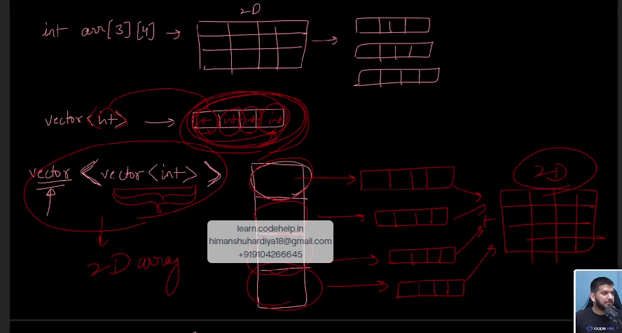

#### Syntax:
```cpp
vector<vector<int>> arr(4, vector<int>(4,0))
```
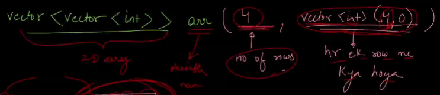

#### Code:
```cpp
#include <iostream>
#include <vector>
using namespace std;

int main()
{
    // 2D Vector

    vector<vector<int>> arr(4, vector<int>(4, 0));

    // rowcount:
    cout << "Total rows  : " << arr.size() << endl;

    // columncount
    cout << "Total columns : " << arr[0].size() << endl
         << endl;

    // create 2D vector with different size of columns on eachrow (Jagged Array):
    vector<vector<int>> arr2(4);
    arr2[0] = vector<int>(4);
    arr2[1] = vector<int>(2);
    arr2[2] = vector<int>(5);
    arr2[3] = vector<int>(3);

    // Jagged Array rowcount
    cout << "Total rows  : " << arr2.size() << endl;

    // Jagged Array columncount
    cout << "Total columns  : " << endl;
    for (int i = 0; i < arr2.size(); i++)
    {
        cout << "No. of columns in row " << i + 1 << " is " << arr2[i].size() << endl;
    }
    cout << endl;

    return 0;
}
```

### List:

Array require contagious memory location to store data, while List is non-contagious approach to store user's data.

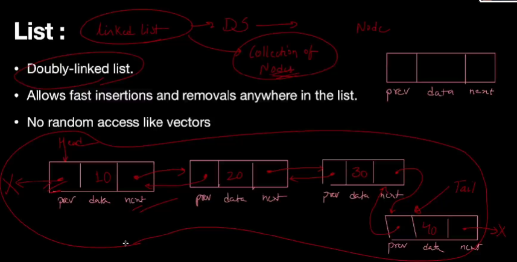

#### Member Functions:
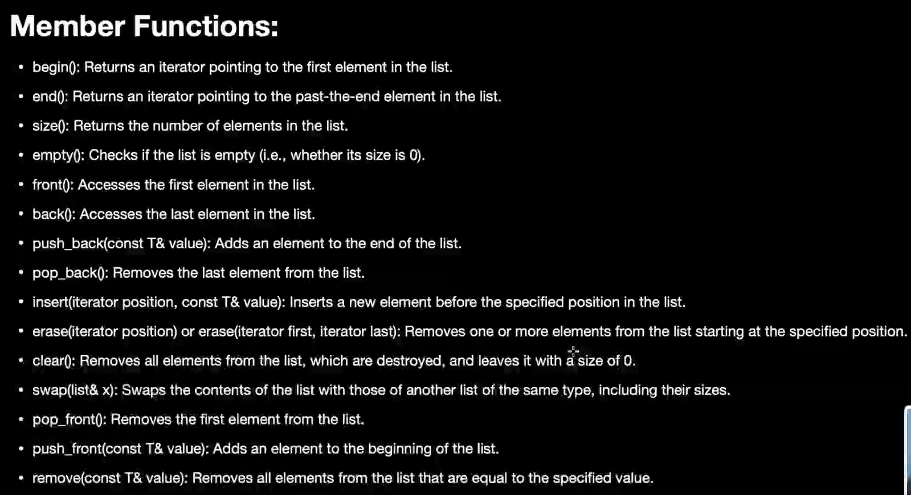

#### Code:
```cpp
#include <iostream>
#include <list>
using namespace std;

int main()
{
    // creation
    list<int> myList;

    // insertion
    myList.push_back(10);
    myList.push_back(20);
    myList.push_back(30);

    myList.push_front(6);
    myList.push_front(4);
    myList.push_front(2);

    // removal
    myList.pop_back();
    myList.pop_front();

    // size
    cout << "Size of list : " << myList.size() << endl
         << endl;

    // clear
    myList.clear();
    cout
        << "Size of list : " << myList.size() << endl
        << endl;

    // is empty
    if (myList.empty())
    {
        cout << "List is empty!" << endl
             << endl;
    }
    else
    {

        cout << "List is not empty!" << endl
             << endl;
    }

    // front
    myList.push_back(2);
    myList.push_front(1);
    cout << "Front: " << myList.front() << endl
         << endl;

    // back
    cout << "Back: " << myList.back() << endl
         << endl;

    // traverse'
    list<int>::iterator it = myList.begin();
    cout << "The list : ";
    while (it != myList.end())
    {
        cout << *it << " ";
        it++;
    }
    cout << endl
         << endl;

    // remove
    myList.push_back(1);
    // now my list is 1=>2=>1
    myList.remove(1);
    cout << "The list after using remove() : ";
    list<int>::iterator it2 = myList.begin();
    while (it2 != myList.end())
    {
        cout << *it2 << " ";
        it2++;
    }
    cout << endl
         << endl;

    // swap
    list<int> first;
    list<int> second;

    first.push_back(10);
    first.push_back(20);
    second.push_back(1);
    second.push_back(2);

    cout << "The list before : ";
    list<int>::iterator it3 = first.begin();
    while (it3 != first.end())
    {
        cout << *it3 << " ";
        it3++;
    }
    cout << endl
         << endl;

    first.swap(second);

    cout << "The list after : ";
    list<int>::iterator it4 = first.begin();
    while (it4 != first.end())
    {
        cout << *it4 << " ";
        it4++;
    }
    cout << endl
         << endl;

    // insert (insert(iterator,value))
    // first : 1=>2
    first.insert(first.begin(), 0);
    cout << "The list after using insert : ";
    list<int>::iterator it5 = first.begin();
    while (it5 != first.end())
    {
        cout << *it5 << " ";
        it5++;
    }
    cout << endl
         << endl;

    // erase (erase(start_address, end_address))
    first.erase(first.begin(), first.end());
    cout << "The list after using erase : ";
    list<int>::iterator it6 = first.begin();
    while (it6 != first.end())
    {
        cout << *it6 << " ";
        it6++;
    }
    cout << endl
         << endl;
    return 0;
}
```

### Queue:
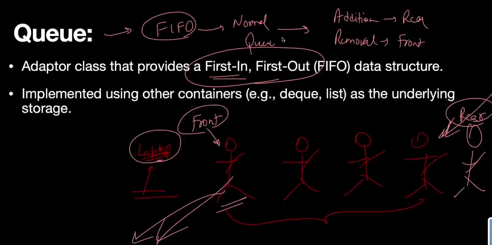

#### Member Function:
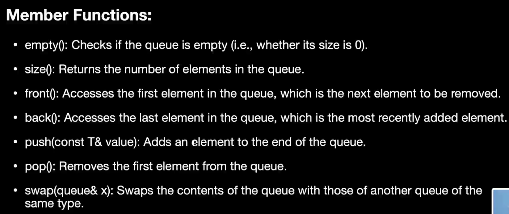

#### Code:
```cpp
#include <iostream>
#include <queue>
using namespace std;

int main()
{
    // creation
    queue<int> q;

    // insertion
    q.push(10);
    q.push(20);
    q.push(30);
    // 10,20,30

    // removal
    q.pop();
    // 20,30

    // size
    cout << "The Queue size is " << q.size() << endl
         << endl;

    // empty
    if (q.empty())
    {
        cout << "Queue is Empty!" << endl
             << endl;
    }
    else
    {
        cout << "Queue is not Empty!" << endl
             << endl;
    }

    // front
    cout << "Front : " << q.front() << endl
         << endl;

    // back
    cout << "Back : " << q.back() << endl
         << endl;

    // swap
    queue<int> first;
    queue<int> second;

    first.push(1);
    first.push(2);

    second.push(10);
    second.push(20);

    cout << "Queue 1 before swap : " << first.front() << " " << first.back() << endl
         << endl;

    first.swap(second);

    cout << "Queue 1 after swap : " << first.front() << " " << first.back() << endl
         << endl;

    // printing
    cout << "Queue : ";
    while (!first.empty())
    {
        cout << first.front() << " ";
        first.pop();
    }
    cout << endl;

    return 0;
}
```

### Stack:
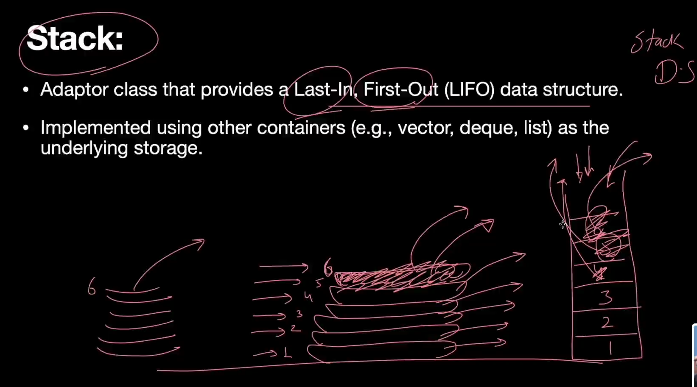

#### Member Functions:
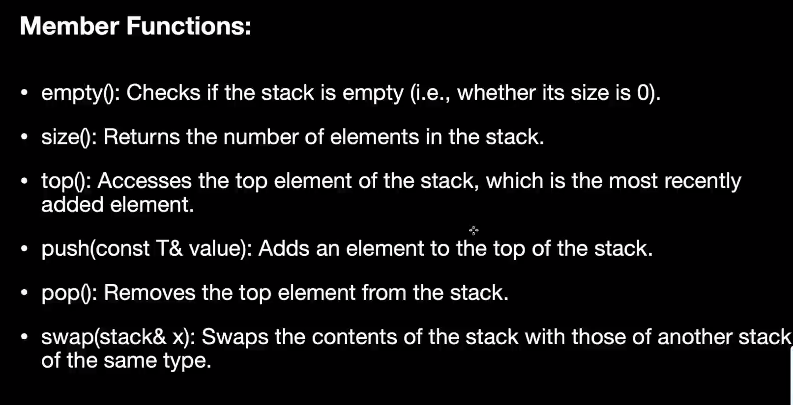

#### Code:

```cpp
#include <iostream>
#include <stack>
using namespace std;

int main()
{
    // creation
    stack<int> st;

    // insertion
    st.push(10);
    st.push(20);
    st.push(30);
    // st =>
    //   30
    //   20
    //   10

    // removal
    st.pop();
    // st =>
    //   20
    //   10

    // size
    cout << "Size : " << st.size() << endl
         << endl;

    // top => to observe/access topmost element in stack
    cout << "Top : " << st.top() << endl
         << endl;

    // empty
    if (st.empty())
    {
        cout << "Stack is empty!" << endl
             << endl;
    }
    else
    {
        cout << "Stack is not empty!" << endl
             << endl;
    }

    // swap
    stack<int> first;
    stack<int> second;

    first.push(1);
    first.push(2);
    second.push(10);
    second.push(20);

    cout << "First stack top before swap: " << first.top() << endl
         << endl;

    first.swap(second);

    cout
        << "First stack top after swap: " << first.top() << endl
        << endl;

    // printing
    cout << "Stack : ";
    while (!first.empty())
    {
        cout << first.top() << " ";
        first.pop();
    }
    cout << endl;

    return 0;
}
```

### Deque:
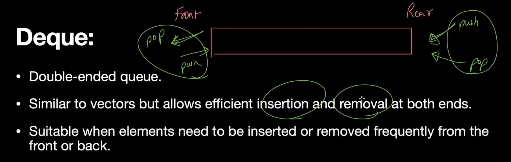

#### Member Functions:
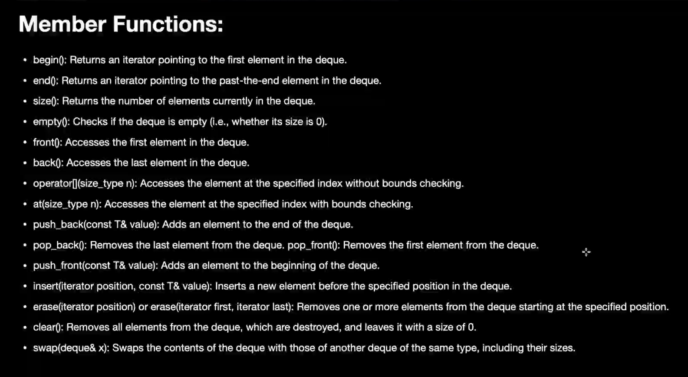

#### Code:
```cpp
#include <iostream>
#include <queue>
using namespace std;

int main()
{
    // creation
    deque<int> dq;

    // insertion
    dq.push_back(10);
    dq.push_back(20);
    dq.push_back(30);
    // dq => 10,20,30

    dq.push_front(7);
    dq.push_front(5);
    dq.push_front(3);
    // dq => 3,5,7,10,20,30

    // removal
    dq.pop_back();
    // dq => 3,5,7,10,20
    dq.pop_front();
    // dq => 5,7,10,20

    // size
    cout << "Size : " << dq.size() << endl
         << endl;

    // front
    cout << "Front : " << dq.front() << endl
         << endl;

    // back
    cout << "Back : " << dq.back() << endl
         << endl;

    // empty
    if (dq.empty())
    {
        cout << "Deque is empty!" << endl
             << endl;
    }
    else
    {
        cout << "Deque is not empty!" << endl
             << endl;
    }

    // iterator
    deque<int>::iterator it = dq.begin();
    cout << "Deque : ";
    while (it != dq.end())
    {
        cout << *it << " ";
        it++;
    }
    cout << endl
         << endl;

    // dq[i] and dq.at(i)
    // dq => 5,7,10,20
    cout << "Value at 1 index : " << dq[1] << endl
         << endl;
    cout << "Value at 1 index using at : " << dq.at(1) << endl
         << endl;

    // Now insert(pos, value), erase(pos1, pos2), clear(), swap() are same as used in vector.

    // erase
    dq.erase(dq.begin(), dq.end());
    cout << "Size of dq after erase : " << dq.size() << endl
         << endl;

    // insert
    dq.insert(dq.begin(), 1);
    cout << "Value at 0 index after insert(): " << dq[0] << endl
         << endl;

    // clear
    cout << "Deque Size : " << dq.size() << endl
         << endl;
    dq.clear();
    cout << "Now Deque Size : " << dq.size() << endl;
 
    return 0;
}
```

### Priority Queue:
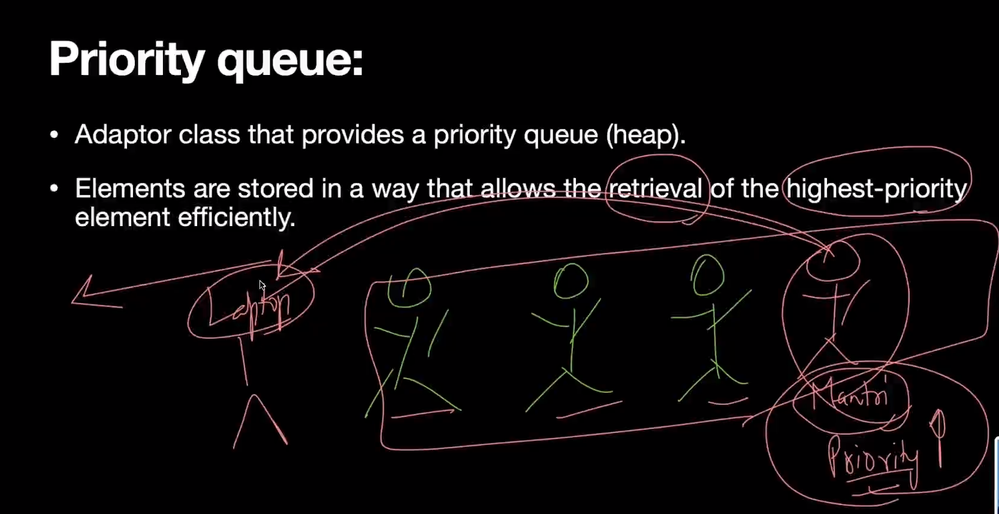

#### Code:

```cpp
#include <iostream>
#include <queue>
using namespace std;

int main()
{
    // min-heap => minimum value => highest priority:
    // creation
    priority_queue<int, vector<int>, greater<int>> pq1;

    // insertion
    pq1.push(10);
    pq1.push(30);
    pq1.push(20);
    // pq =>
    // 10
    // 20
    // 30

    // removal
    pq1.pop();
    // pq =>
    // 20
    // 30

    // top => it has highest priority
    cout << "Top element (min-heap): " << pq1.top() << endl
         << endl;

    // size
    cout << "Size (min-heap) : " << pq1.size() << endl
         << endl;

    // ************************************* //

    // creation
    priority_queue<int> pq;

    // max-heap => maximum value => highest priority

    // insertion
    pq.push(10);
    pq.push(30);
    pq.push(20);
    pq.push(60);
    // pq =>
    // 60
    // 30
    // 20
    // 10

    // removal
    pq.pop();
    // pq =>
    // 30
    // 20
    // 10

    // top => it has highest priority
    cout << "Top element : " << pq.top() << endl
         << endl;

    // size
    cout << "Size : " << pq.size() << endl
         << endl;

    // empty
    if (pq.empty())
    {
        cout << "Priority Queue is Empty!" << endl
             << endl;
    }
    else
    {
        cout << "Priority Queue is not Empty!" << endl
             << endl;
    }

    // swap() is same as others.

    return 0;
}
```

### Map:
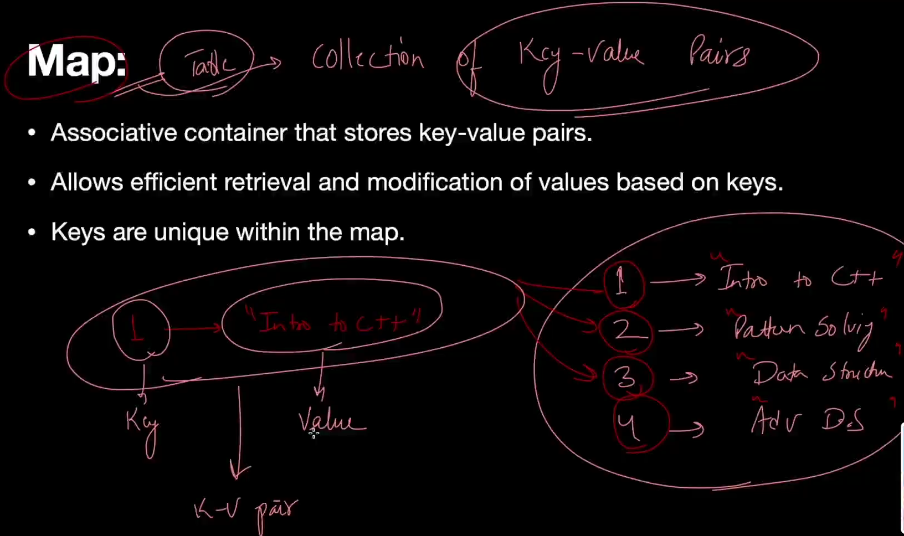
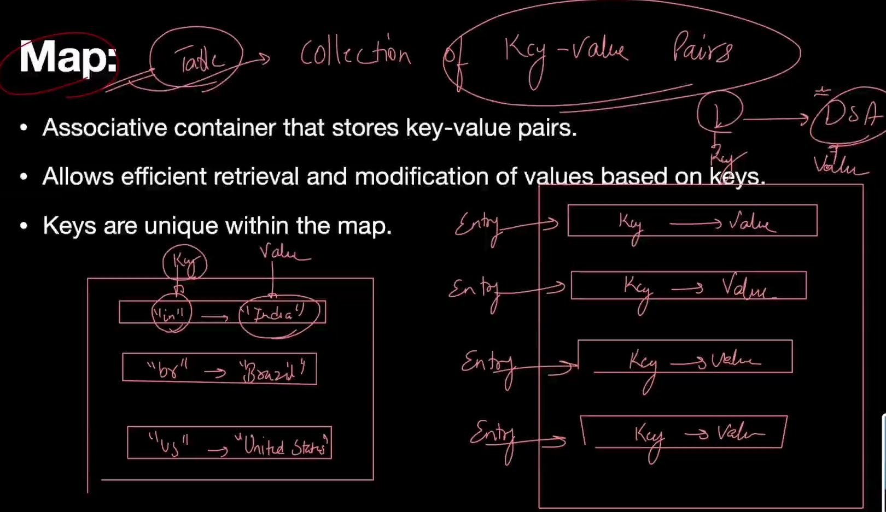

#### Types:
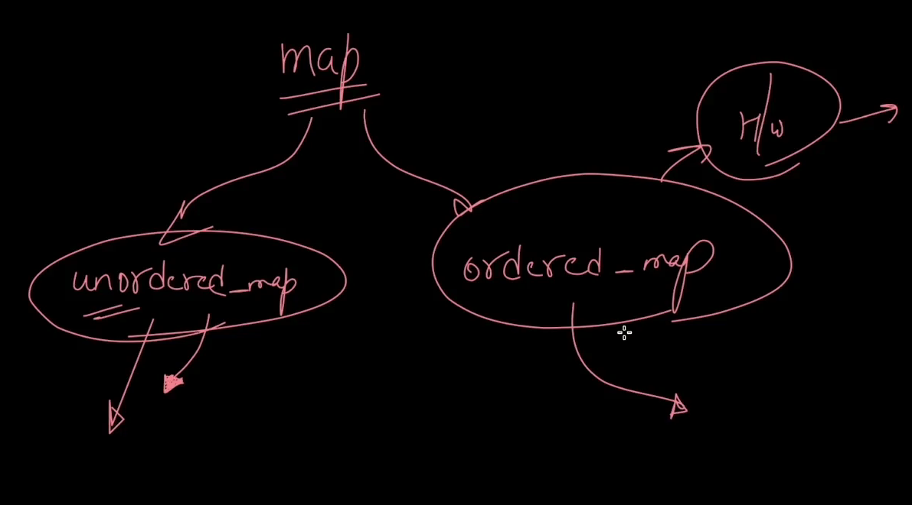

#### Member Functions:
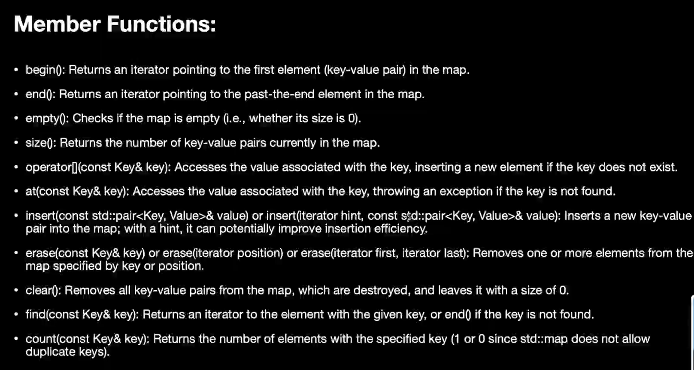

#### Code:
```cpp
#include <iostream>
#include <map>
#include <unordered_map>
using namespace std;

int main()
{
    // ordered map:
    // all insertion and operations complexity are O(log n)

    // creation
    map<string, string> table1;

    // insertion
    table1["in"] = "India";
    table1.insert(make_pair("en", "England"));
    pair<string, string> p1;
    p1.first = "br";
    p1.second = "Brazil";
    table1.insert(p1);

    // traverse
    map<string, string>::iterator it1 = table1.begin();
    cout << "The Ordered Map : " << endl;
    while (it1 != table1.end())
    {
        pair<string, string> p1 = *it1;
        cout << "key : " << p1.first << " , " << "value : " << p1.second << endl;
        it1++;
    }
    cout << endl;

    // *************************************** //

    // creation
    unordered_map<string, string> table;

    // insertion
    table["in"] = "India";

    table.insert(make_pair("en", "England"));

    pair<string, string> p;
    p.first = "br";
    p.second = "Brazil";
    table.insert(p);

    // size
    cout << "Size : " << table.size() << endl
         << endl;

    // table[key] and table.at(key)
    cout << "Value at key=>in : " << table["in"] << endl
         << endl;
    cout << "Value at key=>in using at() : " << table.at("in") << endl
         << endl;

    // updation
    table.at("in") = "Bharat";
    cout << "Updated key=>in : " << table.at("in") << endl
         << endl;

    // iterator
    unordered_map<string, string>::iterator it = table.begin();
    cout << "The Map : " << endl;
    while (it != table.end())
    {
        pair<string, string> p = *it;
        cout << "key : " << p.first << " , " << "value : " << p.second << endl;
        it++;
    }
    cout << endl;

    // find
    if (table.find("jp") != table.end())
    {
        cout << "key found!" << endl
             << endl;
    }
    else
    {
        cout << "key not found!" << endl
             << endl;
    }

    // count
    if (table.count("in") == 0)
    {
        cout << "(count) key not found!" << endl
             << endl;
    }
    if (table.count("in") == 1)
    {
        cout << "(count) key found!" << endl
             << endl;
    }

    // clear
    table.clear();
    cout << "Size after clear : " << table.size() << endl
         << endl;

    // empty
    if (table.empty())
    {
        cout << "Map is empty!" << endl
             << endl;
    }
    else
    {
        cout << "Map is not empty!" << endl
             << endl;
    }

    // erase
    table["in"] = "India";
    table["ch"] = "China";
    table["sr"] = "Sri Lanka";
    table.erase(table.begin(), table.end());
    cout << "Size of table after erase : " << table.size() << endl
         << endl;

    return 0;
}
```

### Set:
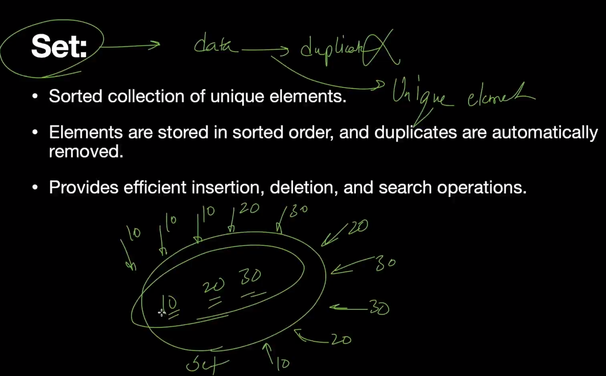

#### Types:
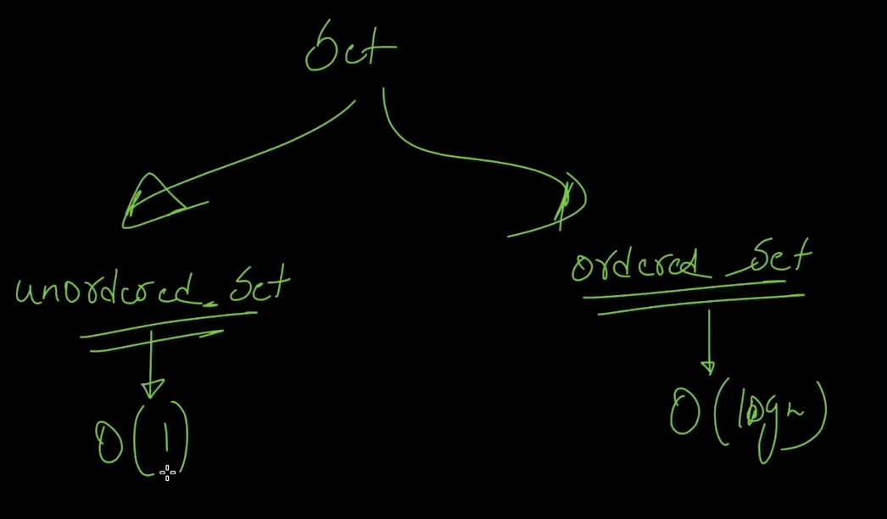


#### Member Functions:
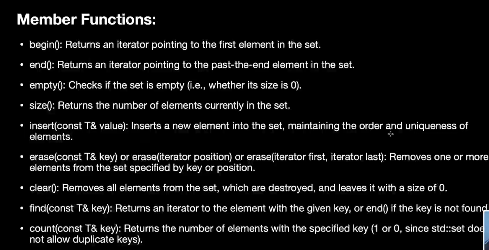

#### Code:
```cpp
#include <iostream>
#include <set>
#include <unordered_set>
using namespace std;

int main()
{
    // creation
    set<int> s;

    // insertion
    s.insert(10);
    s.insert(30);
    s.insert(20);

    // traverse
    set<int>::iterator it = s.begin();
    cout << "Set : " << endl;
    while (it != s.end())
    {
        cout << *it << " ";
        it++;
    }
    cout << endl
         << endl;

    //  all other methods size(), clear(), empty(), erase(), find(), count() are same.

    // ************************************* //

    // unordered set
    // creation
    unordered_set<int> s1;

    // insertion
    s1.insert(10);
    s1.insert(30);
    s1.insert(20);

    // traverse
    unordered_set<int>::iterator it1 = s1.begin();
    cout << "Unordered Set : " << endl;
    while (it1 != s1.end())
    {
        cout << *it1 << " ";
        it1++;
    }
    cout << endl;

    //  all other methods size(), clear(), empty(), erase(), find(), count() are same.

    return 0;
}
```

