# Searching and Sorting-01

## Searching: Linear Search already completed
- Time Complexity of Linear Search: O(N)
- Space Complexity of Linear Search : O(1)

## Binary Search:

### Why use Binary Search?
Because the Time Complexity of Binary Search is O(log n), Binary Search is generally more efficient than Linear Search, especially for large datasets. Linear Search has a time complexity of O(n), while Binary Search has a time complexity of O(log n)

Ex : On comparing in 1000000000 number of Operations.

Linear Searchwill perform 100cr comparison. While Binary Search will perform only 1000 comparison

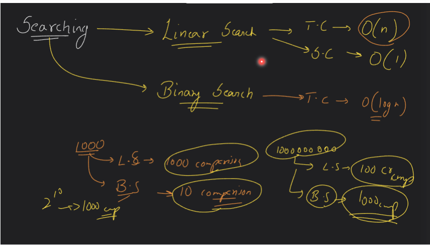

It is much faster algorithm than Linear Search.

### Cons:

The Condition which apply on Binary Search: 

Where there is monotonic function(order is either increasing or decreasing)

Ex:

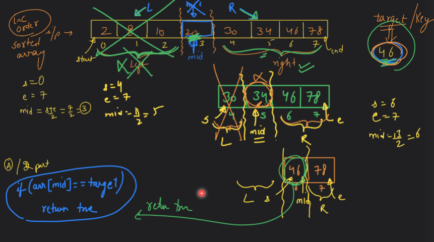

### Pseudocode/Steps:

- Set 2 pointer one is start and other is end on whole sorted array.

- Divide array into 2 halves, find mid value, mid=(start+end)/2 or prefer start+((end-start)/2).

-  if(arr[mid]==target){
    return true
}

- If not found on mid, then move either left or right depends on arr[mid] whether target is greater or less than mid.(this will shorten the array size to search for target).

- Update start or end and mid.

- Repeat step-2 till element found at arr[mid].

### Ex-2:

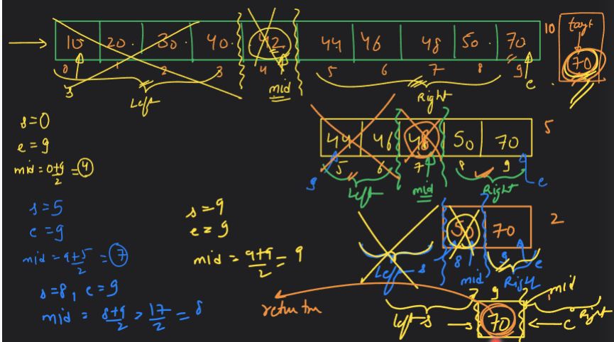

### Ex-3:

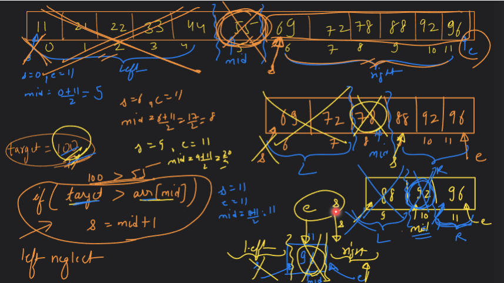

### Ex-4:

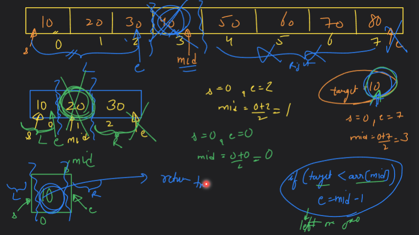

### Observation:

- s>e  => invalid array STOP loop
- s<=e  => valid array continue on loop
- if(arr[mid]==target)  => return true
- if(target>arr[mid])  => move right, s=mid+1 
- if(target<arr[mid])  => move left, e=mid-1

#### Dry Run:

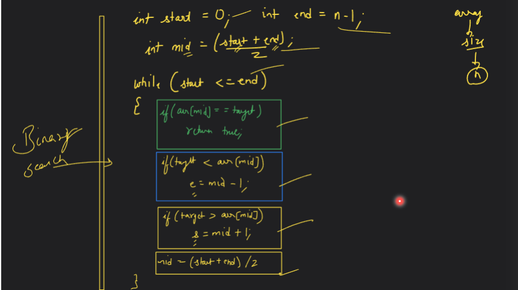

### Q. Leetcode problem:

#### Binary Search:

- Prefer to use int mid = start+((end-start)/2).

- Reason:
    s+((e-s)/2)

    s+e/2-s/2

    s-s/2+e/2

    s/2+e/2

    (s+e)/2

#### Solution:

```cpp
class Solution {
public:
    int search(vector<int>& nums, int target) {
        int n = nums.size();
        int start = 0;
        int end = n-1;
        int mid = start+((end-start)/2);

        while(start<=end){
            if(nums[mid]==target){
                return mid;
            }
            if(target>nums[mid]){
                start=mid+1;
            }
            else if(target<nums[mid]){
                end=mid-1;
            }
            mid = start+((end-start)/2);
        }
        return -1;
    }
};
```
### Q. How we get "log n" time complexity in Binary Search?
1.
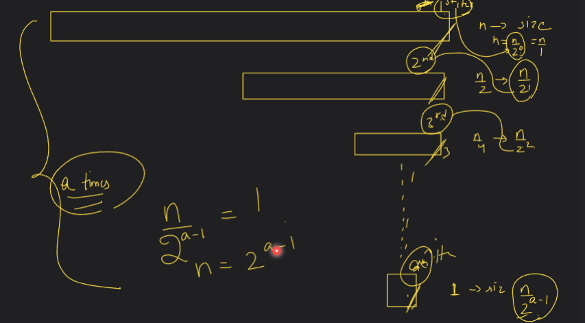

2.
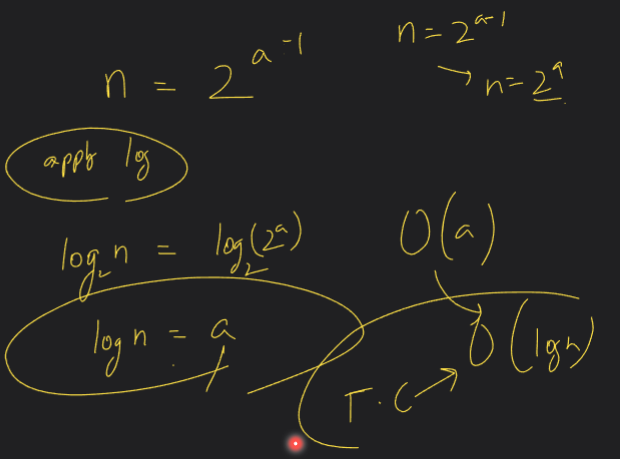

3.(Imp)

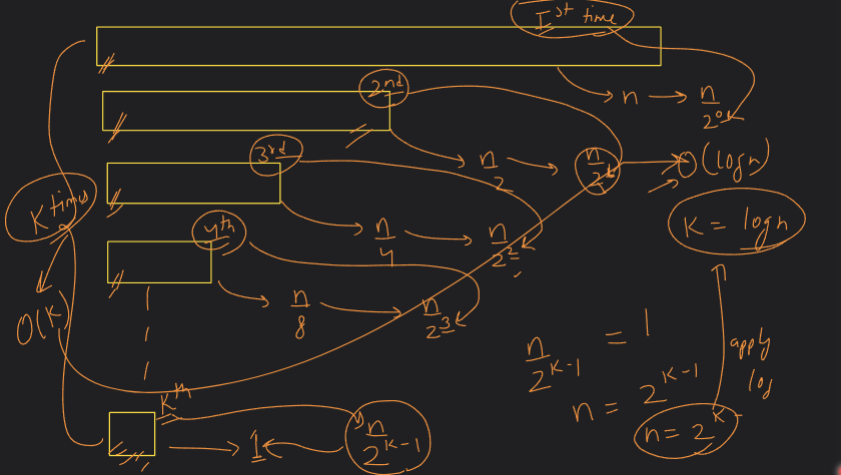

### Ex of Decreasing Order:

#### Remember:
- if(target<arr[mid]){
    s=mid+1
}

- if(target>arr[mid]){
    e=mid-1
}

1.

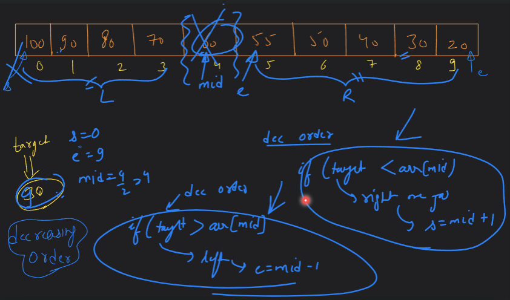


### Using binary_search algorithm from #include<algorithm>

```cpp
#include <iostream>
#include<algorithm>
using namespace std;

int main() {
    int arr[] = {10,20,30,40,50};
    int n = 5;
    int target = 40;
    bool ans = binary_search(arr, arr+n, target);
    cout<<ans<<endl;
    return 0;
}
```
#### Output:

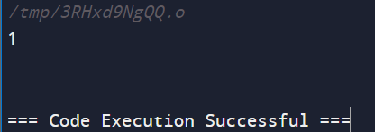


### Q. Find First Occurence (index return) :

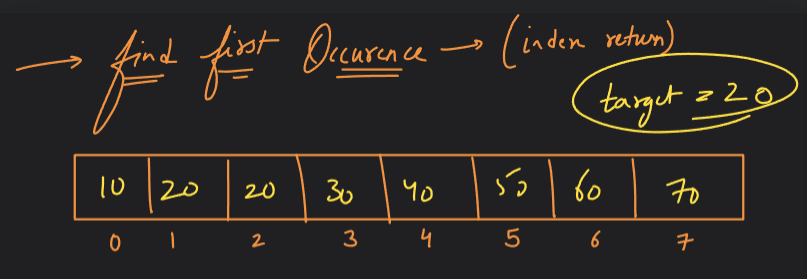

MOST IMPORTANT TECHNIQUE :

**Store and Compute**
whenever we found any target element we store its index, as we have to calculate first occurence so we move left i.e e=mid-1, to ensure we get leftmost or first occurence.

Similiarly we continue this step till first occurence searching but we stop when s<=e will not satisfied.

#### Explaination:
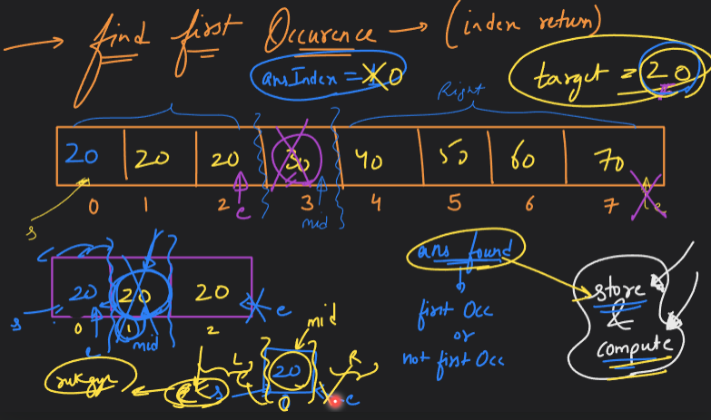

#### Code:
```cpp
#include <iostream>
using namespace std;

void findFirstOccurence(int arr[], int n, int target, int &ansIndex)
{
    int s = 0;
    int e = n - 1;
    int mid = s + (e - s) / 2;

    while (s <= e)
    {
        if (arr[mid] == target)
        {
            // ans may or may not be first occurence
            // use store and compute
            ansIndex = mid;
            e = mid - 1;
        }
        if (target > arr[mid])
        {
            s = mid + 1;
        }
        else if (target < arr[mid])
        {
            e = mid - 1;
        }
        // Remember
        mid = s + (e - s) / 2;
    }
}

int main()
{

    int arr[] = {5, 15, 20, 20, 20, 20, 20, 20, 30, 40, 50, 60};
    int size = 11;
    int target = 20;
    // -1 means target not found;
    int ansIndex = -1;
    findFirstOccurence(arr, size, target, ansIndex);
    cout << "First Occurence Index : " << ansIndex << endl;
    return 0;
}
```

### Dry Run:

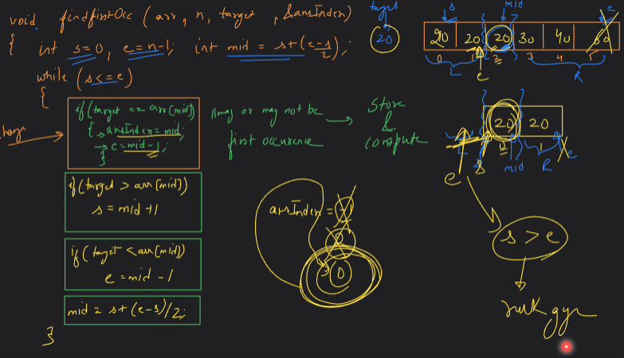

### Q. Find Last Occurence (index return) :

#### Explaination:
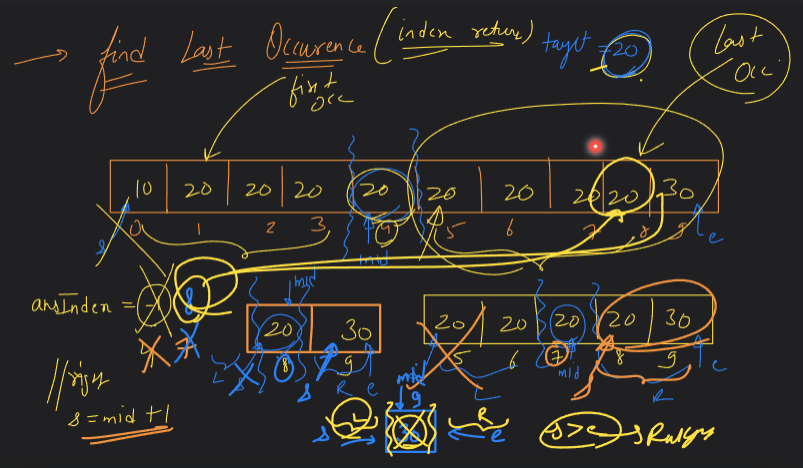

#### Code:

```cpp
#include <iostream>
using namespace std;

void findLastOccurence(int arr[], int n, int target, int &ansIndex)
{
    int s = 0;
    int e = n - 1;
    int mid = s + (e - s) / 2;

    while (s <= e)
    {
        if (arr[mid] == target)
        {
            // ans may or may not be first occurence
            // use store and compute
            ansIndex = mid;
            s = mid + 1;
        }
        if (target > arr[mid])
        {
            s = mid + 1;
        }
        else if (target < arr[mid])
        {
            e = mid - 1;
        }
        // Remember
        mid = s + (e - s) / 2;
    }
}

int main()
{
    int arr[] = {5, 15, 20, 20, 20, 20, 20, 20, 30, 50, 50, 60};
    int size = 11;
    int target = 50;
    // -1 means target not found;
    int ansIndex = -1;
    findLastOccurence(arr, size, target, ansIndex);
    cout << "Last Occurence Index : " << ansIndex << endl;
    return 0;
}
```

### Q. Leetcode Problem:

#### First and Last Position of Element in Sorted Array.

#### Code:

```cpp
class Solution {
public:

void findFirstOccurence(vector<int>& arr, int n, int target, int &ansIndex)
{
    {
        int s = 0;
        int e = n - 1;
        int mid = s + (e - s) / 2;

        while (s <= e)
        {
            if (arr[mid] == target)
            {
                ansIndex = mid;
                e = mid - 1;
            }
            if (target > arr[mid])
            {
                s = mid + 1;
            }
            else if (target < arr[mid])
            {
                e = mid - 1;
            }
            // Remember
            mid = s + (e - s) / 2;
        }
    }
}

void findLastOccurence(vector<int>& arr, int n, int target, int &ansIndex)
{
    int s = 0;
    int e = n - 1;
    int mid = s + (e - s) / 2;

    while (s <= e)
    {
        if (arr[mid] == target)
        {
            ansIndex = mid;
            s = mid + 1;
        }
        if (target > arr[mid])
        {
            s = mid + 1;
        }
        else if (target < arr[mid])
        {
            e = mid - 1;
        }
        // Remember
        mid = s + (e - s) / 2;
    }
}

    vector<int> searchRange(vector<int>& nums, int target) {
        int n=nums.size();
        int firstOccurIndex = -1;
        findFirstOccurence(nums, n, target, firstOccurIndex);
        int lastOccurIndex = -1;
        findLastOccurence(nums, n, target, lastOccurIndex);

        vector<int> temp(2);
        temp[0] = firstOccurIndex;
        temp[1] = lastOccurIndex;
        return temp;
    }
};
```

### Q. Find Total Occurence:
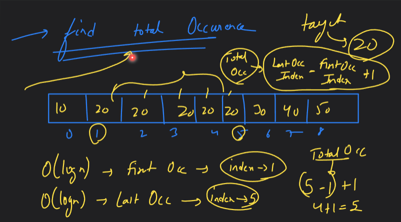

#### Code:

```cpp
#include <iostream>
using namespace std;

void findFirstOccurence(int arr[], int n, int target, int &ansfIndex)
{
    {
        int s = 0;
        int e = n - 1;
        int mid = s + (e - s) / 2;

        while (s <= e)
        {
            if (arr[mid] == target)
            {
                // ans may or may not be first occurence
                // use store and compute
                ansfIndex = mid;
                e = mid - 1;
            }
            if (target > arr[mid])
            {
                s = mid + 1;
            }
            else if (target < arr[mid])
            {
                e = mid - 1;
            }
            // Remember
            mid = s + (e - s) / 2;
        }
    }
}

void findLastOccurence(int arr[], int n, int target, int &anslIndex)
{
    int s = 0;
    int e = n - 1;
    int mid = s + (e - s) / 2;

    while (s <= e)
    {
        if (arr[mid] == target)
        {
            // ans may or may not be first occurence
            // use store and compute
            anslIndex = mid;
            s = mid + 1;
        }
        if (target > arr[mid])
        {
            s = mid + 1;
        }
        else if (target < arr[mid])
        {
            e = mid - 1;
        }
        // Remember
        mid = s + (e - s) / 2;
    }
}

int main()
{
    int arr[] = {5, 15, 20, 20, 20, 20, 20, 20, 30, 50, 50, 60};
    int size = 11;
    int target = 20;
    // -1 means target not found;
    int ansfIndex = -1;
    int anslIndex = -1;
    findFirstOccurence(arr, size, target, ansfIndex);
    findLastOccurence(arr, size, target, anslIndex);
    cout << "Total Occurence : " << (anslIndex - ansfIndex + 1) << endl;
    return 0;
}
```

### Q. MostImp => Find Missing Number:

#### LeetCode: 268. Missing Number

Homework => APPROACH:1=> Using XOR

Homework => APPROACH:2 => Using total sum of [0-n] array - sum of given array.

APPROACH:3 => First Sort given array.(sort(arr,arr+n))

#### Code:

```cpp
class Solution {
public:
    int missingNumber(vector<int>& nums) {
        sort(nums.begin(), nums.end());
        int ansIndex=-1;
        int n = nums.size();
        int s=0;
        int e=n-1;
        int mid=s+(e-s)/2;

        while(s<=e){
            int n=nums[mid];
            int index = mid;
            int diff = n-index;
            if(diff==0){
                s=mid+1;
            }
            else if(diff==1){
                ansIndex = index;
                e=mid-1;
            }
            mid=s+(e-s)/2;
        }
        if(ansIndex==-1){
            return n;
        }
        return ansIndex;
    }
};
```


