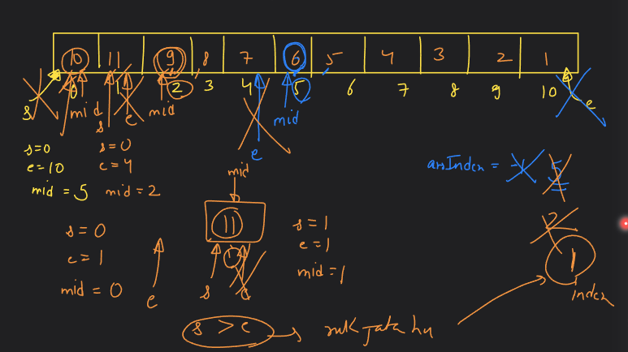
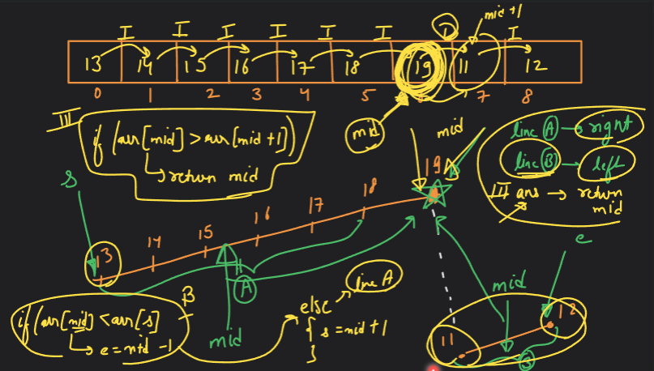
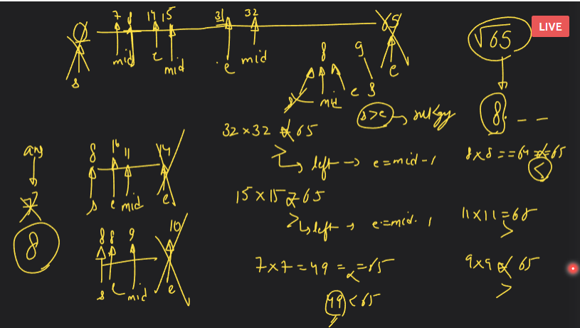
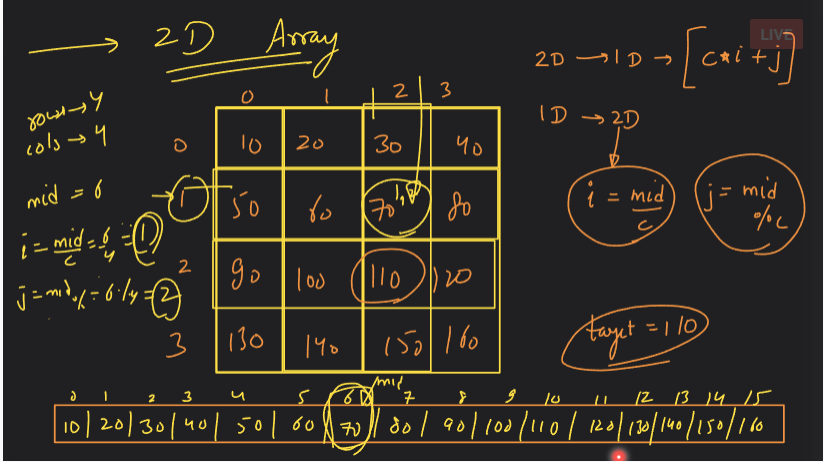

# Searching and Sorting-02

## IMP Binary Search Que's.

### Q. Peak index in a mountain array(LeetCode 852.)

#### Approach:


#### LeetCode Solution:
```cpp
class Solution {
public:
    int peakIndexInMountainArray(vector<int>& arr) {
        int s=0;
        int e=arr.size()-1;
        int mid=s+(e-s)/2;
        int ansIndex=-1;
        while(s<=e){
            if(arr[mid]<arr[mid+1]){
                s=mid+1;
            }
            else{
                ansIndex=mid;
                e=mid-1;
            }
            mid=s+(e-s)/2;
        }
        return ansIndex;
    }
};
```

#### Homework:


### Q. Pivot Que => Search in Rotated Sorted Array (LeetCode 33.)

#### Approach:


#### LeetCode Solution:
```cpp
class Solution {
public:
    int getPivotIndex(vector<int>& arr) {
        int s = 0;
        int n = arr.size();
        int e = n-1;
        int mid = s+(e-s)/2;

        while(s <= e) {
            if(s == e) {
                return s;
            }
            if(mid+1 < n && arr[mid] > arr[mid+1]) {
                return mid;
            }
            if(arr[s] > arr[mid] ) {
                e = mid-1;
            }
            else {
                s = mid+1;
            }
            mid = s+(e-s)/2;
        }
        return -1;
    }
    int binarySearch(int s, int e, int target, vector<int> arr) {
        int mid = s+(e-s)/2;
        while(s<=e) {
            if(arr[mid] == target) {
                return mid;
            }
            if(target > arr[mid]) {
                s = mid+1;
            }
            else {
                e = mid-1;
            }
            mid = s+(e-s)/2;
        }
        return -1;
    }
    int search(vector<int>& nums, int target) {

        int pivotIndex = getPivotIndex(nums);

        int n = nums.size();
        if(target >= nums[0] && target <= nums[pivotIndex]) {
            int ans = binarySearch(0, pivotIndex, target, nums);
            return ans;
        }
        else {
            int ans = binarySearch(pivotIndex+1, n-1, target, nums);
            return ans;
        }
        return -1;
         
    }
};
```

### Q. Search Space Pattern (LeetCode 69. => Sqrt(x))

#### Approach:


#### LeetCode Solution:
```cpp
class Solution {
public:
    int mySqrt(int x) {
        int s=0; int e=x;
        long long int mid = s+(e-s)/2;
        int ans=-1;
        while(s<=e){
            long long int product = mid*mid;
            if(product==x){
                return mid;
            }
            if(product<x){
                ans = mid;
                s = mid+1;
            }
            else{
                e = mid-1;
            }
            mid = s+(e-s)/2;
        }
        return ans;

    }
};
```

### Q. Search in 2D array (LeetCode 74.):

#### Approach:


#### LeetCode Solution:
```cpp
class Solution {
public:
    bool searchMatrix(vector<vector<int>>& matrix, int target) {
        int rows = matrix.size();
        int columns = matrix[0].size();
        int n = rows*columns;

        int s=0;
        int e=n-1;
        int mid=s+(e-s)/2;

        while(s<=e){
            int rowIndex = mid/columns;
            int colIndex = mid%columns;

            if(matrix[rowIndex][colIndex]==target){
                return true;
            }
            if(matrix[rowIndex][colIndex]<target){
                s=mid+1;
            }
            else{
                e=mid-1;
            }
            mid=s+(e-s)/2;
        }
        return false;
    }
};
```