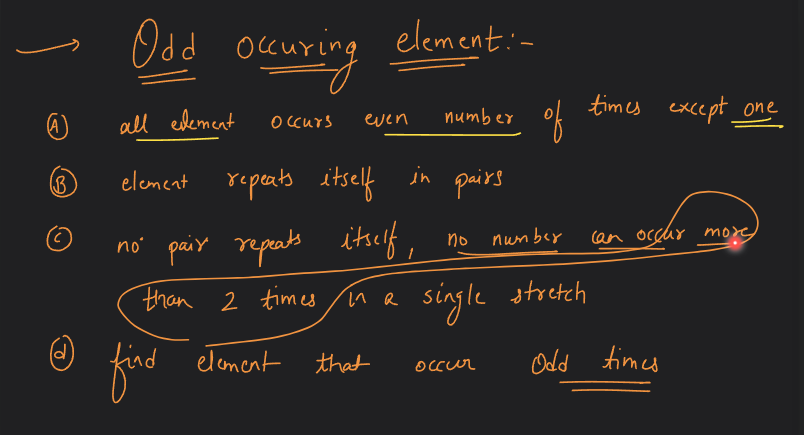

# Searching and Sorting-03

## IMP Binary Search Que's.

### Q. Find Quotient for given dividend and divisor without using "/" and "%".

#### Code:
```cpp
#include <iostream>
using namespace std;

int getQuotient(int dividend, int divisor)
{
    int s = -dividend;
    int e = dividend;
    int mid = s + ((e - s) >> 2);
    int ans = -1;
    while (s <= e)
    {
        if ((divisor * mid) == dividend)
        {
            return mid;
        }
        if ((divisor * mid) < dividend)
        {
            ans = mid;
            s = mid + 1;
        }
        else
        {
            e = mid - 1;
        }
        mid = s + ((e - s) >> 2);
    }
    return ans;
}

int main()
{

    int dividend = -13;
    int divisor = 2;

    int ans = getQuotient(abs(dividend), abs(divisor));
    if ((dividend < 0 && divisor > 0) || (dividend > 0 && divisor < 0))
    {
        ans = 0 - ans;
    }
    cout << "Final Ans: " << ans << endl;

    return 0;
}
```

### Q. Search in a nearly/almost Sorted Array.

#### Approach:


#### Code:
```cpp
#include <iostream>
using namespace std;

int applyBinarySearch(int arr[], int size, int target)
{
    int s = 0;
    int e = size - 1;
    int mid = s + (e - s) / 2;
    while (s <= e)
    {
        if (arr[mid] == target)
        {
            return mid;
        }
        if (arr[mid - 1] == target)
        {
            return mid - 1;
        }
        if (arr[mid + 1] == target)
        {
            return mid + 1;
        }
        if (arr[mid] < target)
        {
            s = mid + 2;
        }
        else
        {
            e = mid - 2;
        }
        mid = s + (e - s) / 2;
    }
    return -1;
}

int main()
{
    int arr[] = {10, 3, 40, 20, 50, 80, 70};
    int size = 7;
    int target = 50;
    int ans = applyBinarySearch(arr, size, target);
    cout << "Found at : " << ans << endl;

    return 0;
}
```

### Q. Odd Occuring Element:


#### Approach:


#### LeetCode Solution:
```cpp
class Solution {
public:
    int singleNonDuplicate(vector<int>& nums) {
        int s=0;
        int e= nums.size()-1;
        int mid= s+((e-s)/2);
        while(s<=e){
            if(s==e){
                return nums[s];
            }
            int currValue = nums[mid];
            int leftValue=-1;
            if(mid-1>=0){
                leftValue=nums[mid-1];
            }
            int rightValue =-1;
            if(mid+1<nums.size()){
                rightValue=nums[mid+1];
            }

            if(currValue != leftValue && currValue != rightValue){
                return currValue;
            }

            if(currValue == leftValue && currValue!=rightValue){
                int pairStartingindex = mid-1;
                if(pairStartingindex&1){
                    e=mid-1;
                }
                else{
                    s=mid+1;
                }
            }

            if(currValue != leftValue && currValue==rightValue){
                int pairStartingindex = mid;
                if(pairStartingindex&1){
                    e=mid-1;
                }
                else{
                    s=mid+1;
                }
            }

            mid= s+(e-s)/2;
        }
        return -1;
    }
};
```