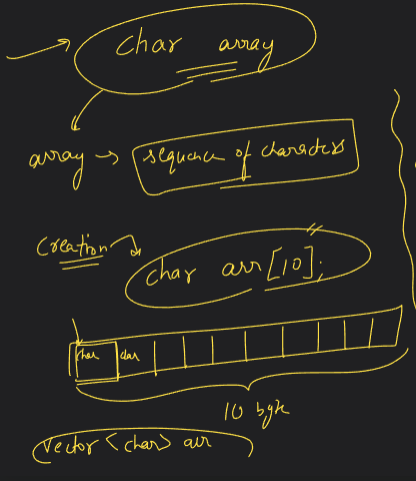

# Char Array and String - 01

## Char Arrays :

### Creation:
#### char arr[size];


#### Access:


#### Why input having space not considered in cin?? => getline()


### Code:
```cpp
#include <iostream>
using namespace std;

int main()
{
    // creation
    char arr[100];

    // input
    cout << "Enter your name: ";
    // cin >> arr;
    // OR
    cin.getline(arr, 100);
    // cin.getline(arr, 100, '\t');

    // output
    cout << "Your name is " << arr << endl;
    for (int i = 0; i < 5; i++)
    {
        cout << "ASCII value of your char " << arr[i] << " is " << int(arr[i]) << endl;
    }

    return 0;
}
```


## Q. Length of Array
### Code:
```cpp
#include <iostream>
using namespace std;

int getLength(char arr[])
{
    int cnt = 0;
    int i = 0;
    while (arr[i] != '\0')
    {
        cnt++;
        i++;
    }
    return cnt;
}

int main()
{

    char arr[100];

    cin >> arr;
    cout << "Size of arr is " << getLength(arr) << endl;

    return 0;
}
```
## Q. Replace character of Array:
### Code:
```cpp
#include <iostream>
using namespace std;

void replaceChar(char oldChar, char newChar, char arr[], int size)
{
    int i = 0;
    while (i < size)
    {
        if (arr[i] == oldChar)
            arr[i] = newChar;
        i++;
    }
}

int main()
{

    char arr[100];

    cin >> arr;
    int size = 10;
    cout << "Old arr is " << arr << endl;
    replaceChar('@', ' ', arr, size);
    cout << "New arr is " << arr << endl;

    return 0;
}
```

## Q. lowercase to uppercase:
### Code:
```cpp
#include <iostream>
using namespace std;

int getLength(char arr[])
{
    int cnt = 0;
    int i = 0;
    while (arr[i] != '\0')
    {
        cnt++;
        i++;
    }
    return cnt;
}

void convertIntoUpperCase(char arr[])
{
    int i = 0;
    int length = getLength(arr);
    while (i < length)
    {
        char ch = arr[i];
        if (ch >= 'a' && ch <= 'z')
        {
            ch = ch - 'a' + 'A';
        }
        arr[i] = ch;
        i++;
    }
}

int main()
{

    char arr[100];

    cin >> arr;
    int size = 10;
    cout << "Old arr is " << arr << endl;
    convertIntoUpperCase(arr);
    cout << "New arr is " << arr << endl;

    return 0;
}
```

## Q. Reverse in char array
### Code:
```cpp
#include <iostream>
using namespace std;

int getLength(char arr[])
{
    int cnt = 0;
    int i = 0;
    while (arr[i] != '\0')
    {
        cnt++;
        i++;
    }
    return cnt;
}

void reverseChar(char arr[])
{
    int len = getLength(arr);
    int i = 0;
    int j = len - 1;
    while (i <= j)
    {
        swap(arr[i], arr[j]);
        i++;
        j--;
    }
}

int main()
{

    char arr[100];
    cin >> arr;
    cout << "Old arr is " << arr << endl;
    reverseChar(arr);
    cout << "New arr is " << arr << endl;
    return 0;
}
```

## Q. Palindrome
### Code:
```cpp
#in`clude <iostream>
using namespace std;

int getLength(char arr[])
{
    int cnt = 0;
    int i = 0;
    while (arr[i] != '\0')
    {
        cnt++;
        i++;
    }
    return cnt;
}

bool checkPalindrome(char arr[])
{
    int len = getLength(arr);
    int i = 0;
    int j = len - 1;
    while (i <= j)
    {
        if (arr[i] == arr[j])
        {
            i++;
            j--;
        }
        else
        {
            return false;
        }
    }
    return true;
}

int main()
{

    char arr[100];
    cin >> arr;
    bool ans = checkPalindrome(arr);
    if (ans)
    {
        cout << "Yes, arr is Palindrome" << endl;
    }
    else
    {
        cout << "No, arr is not Palindrome" << endl;
    }

    return 0;
}
```

## Q. Concatenation
### Code:
```cpp
#include <cstring>
#include <iostream>
using namespace std;

int main()
{

    // concatenation
    char arr[100];
    cout << "Enter input : " << endl;
    cin >> arr;

    char arr2[100];
    cout << "Enter another input : " << endl;
    cin >> arr2;

    cout << "Output : " << strcat(arr, arr2) << endl;

    return 0;
}
```

## String: 

### Code:
```cpp
#include <iostream>
using namespace std;

int main()
{

    // creation
    string str;

    // input
    cout << "Enter String : " << endl;
    cin >> str;
    // OR
    str.push_back('h');
    str.push_back('e');
    str.push_back('l');
    str.push_back('l');
    str.push_back('o');
    // OR
    getline(cin, str);
    getline(cin, str, '\n');
    getline(cin, str, 'A');

    // print
    cout << "Str : " << str << endl;

    // accessing the str;
    string name = "Hello";
    cout << name[0] << endl;
    cout << name.at(0) << endl;

    // front, back, length
    cout << name.front() << endl;
    cout << name.back() << endl;
    cout << name.length() << endl;

    // iterator
    auto it = name.begin();

    while (it != name.end())
    {
        cout << *it << endl;
        it++;
    }

    // empty
    if (name.empty())
    {
        cout << "name is empty!";
    }
    else
    {
        cout << "name is not empty!";
    }
    cout << endl;

    // concatenate
    string one = "hello";
    string two = "ji";
    string ans = one + " " + two;
    cout << ans << endl;

    // substr
    cout << name.substr(0, 3) << endl;
    cout << name.substr(0) << endl;
    cout << name.substr(2) << endl;

    // find
    string word = "name";
    string sentence = "what is your name?";

    int res = sentence.find(word);
    cout << res << endl;

    // compare
    string s1 = "Ravi";
    string s2 = "Kishan";
    cout << s1.compare(s2) << endl;

    return 0;
}
```
